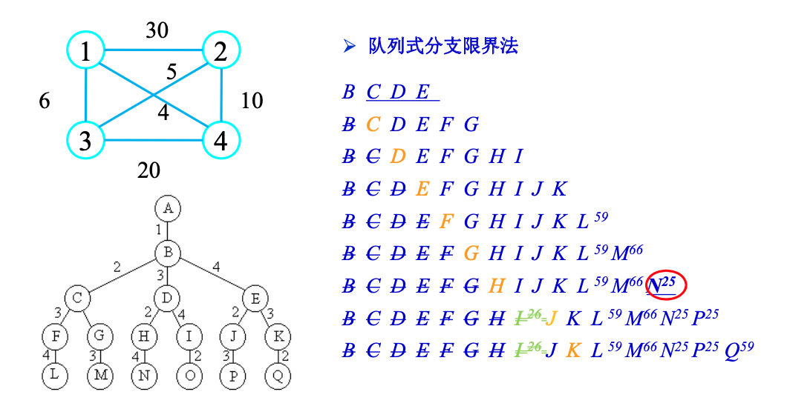
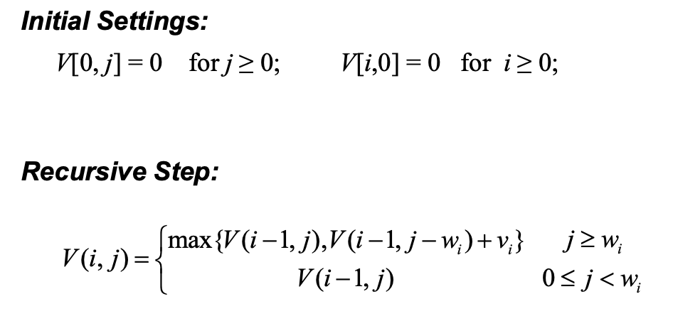
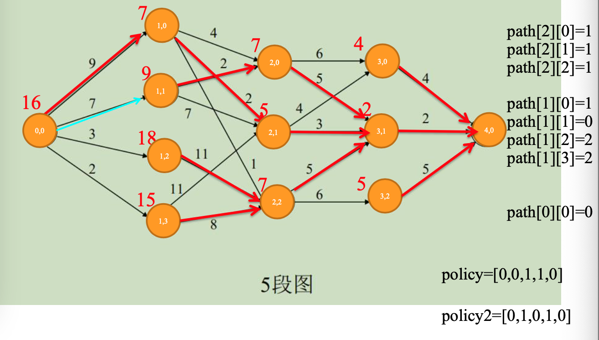

# 1. 引言

>  算法是一系列解决问题的明确指令，也就是说，对于符合 一定规范的输入，能够在有限时间内获得要求的输出。

**算法特点**

- 输入：0或多个有效输入
- 输出：至少一个输出
- 确定性
- 有穷性
- 可行性

**算法举例**

> 以求最大公约数为例

- 欧几里得算法（辗转相除）
  - gcd(m,n)=gcd(n,m mode n)
  - gcd(m,0)=0
- 连续整数检测算法
  - t = min{m, n}
  - 若m/t不余0，t-=1，循环；若m/t余0：若n/t余0，返回t，若不余0，t-=1，返回上一循环。
- 筛选法找小于给定整数的质数序列

**重要问题种类**

- 排序
  - 稳定性
  - in-place
- 查找
  - 结合添加、删除操作

- 字符串处理
  - 如字符串匹配

- 图问题
  - 图遍历
  - 最短路径
  - 有向图拓扑排序
  - TSP旅行商
  - 图填色
- 数值问题
  - 解方程、定积分、评估函数

- 数据结构
  - 线性：数组、链表、堆栈、队列
  - 图
  - 树

# 2. 算法效率分析基础

- $o(g(n))：<$
- $O(g(n))：≤$
- $\Theta(g(n))：=$
- $\Omega(g(n))：≥$
- $\omega(g(n))：>$

**极限法**

$\lim_{n\rightarrow \infin}\frac{T(n)}{g(n)}=0，c，\infin，分别对应T(n)\in O(g(n))，T(n)\in \Theta(g(n))，T(n)\in \Omega(g(n))$

（应用洛必达法则）

**算法复杂度分析**

- 找问题规模n

- 确定基本操作

- 基本操作不依赖于n的方面，用于确定最差、平均、最好运行情况

- 非递归函数

  - 求和基本操作数，得到n的函数

  - 简化函数为时间复杂度

- 递归函数

  - 建立递推关系式和初始条件
  - 解表达式（反向替换法）

# 3. 蛮力法

- 排序问题
  - 选择排序
  - 冒泡排序
- 查找问题
  - 顺序查找
  - 字符串匹配（最差$O(mn)$）
  - 穷举查找
    - 组合问题、优化问题
    - 根据问题规模列出所有可能情况（通常指数级），排除不可行的情况，然后求出剩余情况下目标值

# 5. 减治法

> 利用一个问题给定 实例的解和同样问题较小实例的解之间的某种关系

**分类**

- 减常量（一般是减1）：每次迭代从实例中减去一个相 同常量
  - $a^n=a\times a^{n-1}$
- 减常因子（一般是除以2）：每次迭代问题规模减少相同常因子
  - 一般形式：$T(n)=T(\frac{n}{b})+f(n)$
  - $a^n=(a^{n/2})^2$
  - 对比分治：将$a^n$分成$a^{n/2}$指数下取整、$a^{n/2}$指数上取整两部分，分别计算，两部分并不完全相同；而减常因子中如果减半，只需要算一半。
- 减可变规模：每次迭代规模减小的模式不同
  - 辗转相除：$gcd(m,n)=gcd(n, m\ mod\ n)，gcd(m, 0)=m$

**减常量**

- 插入排序：$O(n^2)$，最好情况$\Theta(n)$，适合于基本有序数列
- 拓扑排序
  - 利用栈，DFS：$O(E+V)$
  - source removal：每次移除一个入度为0的节点，$O(E+V)$

**减常因子**

- 二分查找
- 假币问题
  - 进阶：分成3部分，两部分比较结果可以确定在3个部分中的哪个
- 俄式乘法
  - $n为偶数，n\times m=\frac{n}{2}\times 2m$
  - $n为奇数，n\times m=\frac{n-1}{2}\times 2m+m$

# 6. 分治法

> 与减常因子的减治法区别在于，分治法每次分解问题为更小规模的同类型问题，但还是要对每个子问题进行求解，最后每个子问题的解汇合成原问题的解。而减治法分解后的问题完全一致或很多部分被排除（二分查找），只需要计算一次。

- 分解问题成子问题
- 递归求解子问题
- 综合子问题的解
- 一般形式：$T(n)=aT(\frac{n}{b})+f(n)$
  - 与减常因子的减治法比，后者没有系数a
- 主定理，设$f(n)\in \Theta(n^d)$
  - $T(n)\in \Theta(n^d)，当a<b^d$
  - $T(n)\in \Theta(n^dlog\ n)，当a=b^d$
  - $T(n)\in \Theta(n^{log_ba})，当a>b^d$

**举例**

- 归并排序
- 快速排序
- 大整数乘法
  - X、Y为大整数，分解为$X=A\ 10^{n/2}+B，Y=C\ 10^{n/2}+D$
  - $X*Y=A*C*10^n+(A*D+B*C)*10^{n/2}+B*D$
  - $M(n)=3M(n/2)$，$O(n)=O(n^{log_23})$
- Strassen矩阵乘法
- 棋盘覆盖问题
  - $T(k)=4T(k-1)+O(1)$，$T(n)=O(4^k)$

# 7. 变治法

- 实例简化
- 改变表现
- 问题化简

**实例简化**

- 预排序
  - 查找重复元素：$O(n^2)\rightarrow O(nlog\ n)+O(n)=O(blog\ n)$
  - 求众数：$O(n^2)\rightarrow O(nlog\ n)+O(n)=O(blog\ n)$
  - 查找算法
- 高斯消去法（线性方程组消去系数，直到形成上下三角，$O(n^3)$）
- 堆排序

**改变表现**

- 霍纳法则
  - 多项式可以逐个提出x，不必反复求x的幂，低阶的结果可以用于高阶
  - 蛮力法$O(n^2)$，霍纳法则$O(n)$

**问题化简**

- 线性规划
  - 投资问题
  - 0-1背包问题
- 简化为图
  - 过河问题

# 8. 回溯和分支限界法

**穷举**

**DFS、BFS**

邻接矩阵：$\Theta(V^2)$

邻接表：$\Theta(V+E)$

**回溯**

> 按DFS从根节点出发搜索解空间树。
>
> 判断所在节点为根的子树是否包含解，如果肯定不包含则跳过其搜索，沿着祖先节点回溯；否则继续DFS。
>
> 节约了内存开销，不必保存整个解空间树。内存占用为O(h(n))，h为树高。

剪枝函数

- 用约束函数在扩展结点处剪去**不满足约束**的子树;
-  用限界函数剪去**得不到最优解**的子树。

0-1背包

TSP

尽可能让可选择值最少的优先，这样树上部疏、下部密，剪枝效果更好。

**分支限界**

> 按BFS搜索，裁剪不能得到最优解的子树。
>
> 限界：在新节点中删除不可能导出最优解的节点
>
> 分支：从活动表中选择节点再扩展
>
> 可分为队列、优先队列。

0-1背包（FIFO队列）

0-1背包（按价值率优先队列）

先把物理按价值率排序，每次从队列中选价值率最高的作为新的扩展节点。

TSP（FIFO队列）

TSP（优先队列）

**回溯和分支限界对比**

- 目标
  - 回溯：解空间树中满足条件的所有解
  - 分支限界：尽快找出一个解
- 搜索方法
  - 回溯：基于DFS
  - 分支限界：基于BFS或最佳优先
- 对扩展节点扩展方式
  - 回溯：深度优先向下扩展，过程中剪枝；回溯过程中可以重复访问节点
  - 分支限界：每个活节点只有一次机会成为扩展节点，一旦扩展就将其所有子节点全部产生（判定死活、进入队列或得到解）
- 存储空间要求
  - 分支限界比回溯法空间要求大得多

# 9. 动态规划

> （马尔科夫性）适于动态规划法求解的问题具有状态的无后效性。
>
> 动态规划法用一个表来记录所有已解的子问题的答案，避免重复计算、节省 时间。
>
> - **最优子结构**：问题的最优解是由其子问题的最优解来构造
> - **重叠子问题**：递归算法反复求解相同 的子问题

- 组合数
  - $C(n,k)=C(n-1,k-1)+C(n-1,k)$
  - $C(n,0)=C(n,n)=1$

- 最长公共子串LCS（子串不一定连续，不需要下标对齐）
  - $X=<x_1,x_2...x_m>,Y=<y_1,y_2...y_n>,Z=<z_1,z_2...z_k>是X和Y的任意LCS$
  - 如果$x_m=y_n$，则$z_k=x_m=y_n$且$Z_{k-1}$是$X_{m-1}和Y_{n-1}$的一个LCS。
  - 如果$x_m≠y_n$，则$z_k≠x_m$说明$Z$是$X_{m-1}和Y$的一个LCS。
  - 如果$x_m≠y_n$，则$z_k≠y_n$说明$Z$是$X和Y_{n-1}$的一个LCS。
  - $c[i,j]=0,当i=0或j=0$
  - $c[i,j]=c[i-1,j-1]+1,当i,j>0且x_i=y_j$
  - $c[i,j]=max(c[i,j-1],c[i-1,j]),当i,j>0且x_i≠y_j$

- 矩阵相乘

- 0-1背包

- 多段图
  - 每个阶段的节点的代价更新为从上个阶段节点+边权重中最小的
  - 如此更新所有阶段所有节点
  - $d[i][j]=min\{d[i+1][k]+w[i][k][j]\}$

- Warshall
  - 沿对角线扫描该行、列
  - 对于该列上有1的这些行，把该行加到这些行上去

- Floyd
  - 沿对角线扫描该行、列
  - 对于行、列都有数的交叉点，更新其最短路径

# 10. 贪心

> 总是做出局部最优选择，以期望达到全局最优解
>
> 不一定得到全局最优，可能落入局部最优，考虑梯度下降中的凸优化，取决于目标函数的性质。

若原问题的 整体最优解可以通过一系列局部最优的选择得到，即贪心选 择来达到，则该问题称为具有**贪心选择性质**

若一个问 题的最优解包括它的子问题的最优解，则称其具有**最优子结 构性质**

- 分数背包问题
  - 将单位价值排序：$O(nlog\ n)$
  - 按顺序放入物品，放不下的放入一部分：$O(n)$
  - **0-1背包贪心不能最优解，DP可以**
- Dijkstra算法
  - 求单源最短路径
  - 维护顶点集合，每次从备选集合中找到源点路径最小的加入集合，将其邻接节点加入备选集合

- Prim算法
  - 最小生成树
  - 和Dijkstra的维护集合，但选择加入的节点选的是连接到集合的边最小的节点即可

- Kruskal算法
  - 最小生成树
  - 把边按权重排序，总是选最小的、不构成环的边加入最小生成树，直到只有一个连通分量

