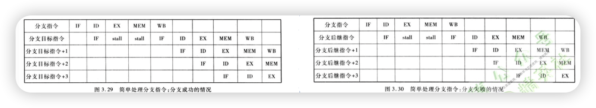
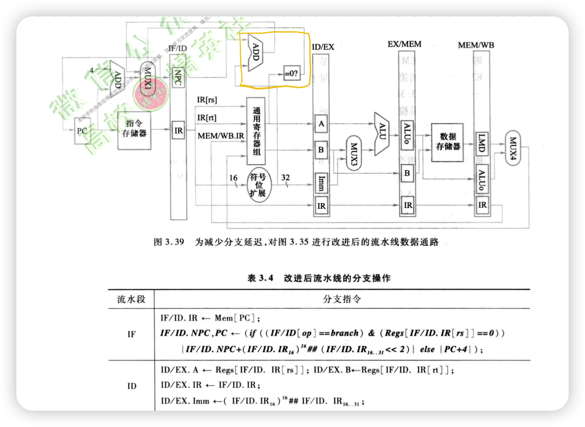

[toc]

### 不要求的内容

- 第一章
  - 1.3.2 的第2点和第3点。
  - 1.4.3
  - 1.4.4

- 第二章
  - P29-36
  - P39-41
  - 2.6的要求：能读懂后面章节中的程序

- 第三章
  - P88-89：了解
  - 3.5

- 第四章
  - 4.4.1-4.4.5

- 第五章                                  
  - 5.2.5 第2点
  - P182
  - P185-186
  - 5.7
  - 5.8

- 第六章
  - 6.4
  - 6.6（了解） 

- 第七章

- 第八章
  - 8.1.3
  - 8.4.2
  - 8.4.3
  - 8.5.2
  - 8.5.3
  - 8.6
  - 8.7
  - 8.8

- 第九章
  - 9.4

- 第十章

# 第一章 计算机系统结构概念

### 1.1 引言

- 计算机的发展
  - 计算机制造技术的发展
  - **计算机系统结构**的创新

- 计算机性能增长率下降
  - 功耗问题
  - 可进一步开发的**指令级并行性**很少
  - **存储器访问速度**提高缓慢
- 计算机系统结构在计算机发展中有重要作用
  - 转折点：从单纯依靠**指令级并行**转向开发**线程级并行和数据级并行**。

### 1.2 计算机系统层次结构

- L6:应用语言虚拟机（面向具体问题）
- L5:高级语言虚拟机（编译器翻译至L4）
- L4:汇编语言虚拟机（先翻译成L3和L2级，再由相应机器执行）
- L3:操作系统虚拟机（传统机器级指令、操作系统级指令：实现对OS功能的调用）

---软件/硬件分界线---

- L2:机器语言虚拟机
- L1:微程序虚拟机（微程序解释L2，计算机硬件设计人员使用）

**翻译**：先将L+1级程序翻译成L级，再顺序执行

- 执行过程中不访问L+1级程序
- 快，但占内存

**解释**：每翻译1条L+1级程序，就直接执行一串等效L级程序，再访问下一条L+1级

- 慢，但内存占用少

**计算机系统结构定义**

- 程序员看到的计算机属性，即概念性结构与功能特性
- **广义定义**：指令集结构、组成、硬件
- **传统定义**：机器语言程序设计员为使其设计的程序能在计算机上正确运行所需遵循的计算机属性
- **实质**：确定计算机系统中软硬件的界面，界面之上是软件实现的功能，之上是硬件实现的功能
- **计算机组成：计算机系统结构的逻辑实现**
  - 着眼于物理机器级内各事件的排序方式与控制方式、各部件的功能以及各部件之间的联系
- **计算机实现：计算机组成的物理实现**
  - 着眼于：器件技术（起主导作用）、微组装技术
- 一种体系结构可以有多种组成，一种组成可以有多种物理实现

**透明性**

计算机技术中，本来存在的事物或属性，从某种角度看好像不存在的概念，称为透明性。

**计算机系统结构分类**

- 冯氏分类法：用系统的最大并行度对计算机进行分类
  - **最大并行度**：计算机系统在单位时间内能够处理的最大的二进制位数
  - 横坐标表示字宽n位，纵坐标表示一次能同时处理的字数m字，mxn就表示最大并行度

- **Flynn分类法**：按照指令流和数据流的多倍性分类
  - 指令流Instruction Stream：计算机执行的指令序列。
  - 数据流Data Stream：由指令流调用的数据序列。
  - 多倍性：在系统受限的部件上，同时处于同一执行阶段的指令或数据的最大数目。
  - Flynn分类法分成四类：
    - **单指令流单数据流**(SISD)：顺序处理计算机
    - **单指令流多数据流**(SIMD)：阵列处理计算机
    - **多指令流单数据**(MISD)：只存在于概念中
    - **多指令流多数据流**(MIMD)：多处理机

下图中基本结构：

- IS：指令流
- DS：数据流
- CS：控制流
- CU：控制部件
- PU：处理部件
- MM和SM：存储器

### 1.3 定量分析技术

**计算机系统设计定量原理**

- 以经常性事件为重点
  - 最重要、最广泛采用的设计原则
  - 对经常发生的情况采用优化方法的原则进行选择，得到更多总体上的改进
- **Amdahl定律**
  - 用于具体计算对当前计算机某部件改进后，能获得多少总体性能提升
  - 加快某部件执行速度能获得的系统性能加速比，受限于该部件的执行时间占比

>  加速比衡量改进后的机器（部件）比之前快多少倍。

$加速比=\frac{改进后系统性能}{改进前系统性能}=\frac{改进前总执行时间}{改进后总执行时间}$

**字母公式**：$k=\frac{P_后}{P_前}=\frac{T_前}{T_后}$

> 部件改进后，总体的执行时间受限于部件的执行时间占比。

$改进后总执行时间$

$=\frac{可改进比例\times 改进前总执行时间}{部件加速比}+(1-可改进比例)\times 改进前总执行时间$

$=改进前总执行时间\times [(1-可改进比例)+\frac{可改进比例}{部件加速比}]$

**字母公式**：$T_后=T_前\times [(1-\alpha)+\frac{\alpha}{k}]$

> Amdahl定律计算总体加速比

$整体加速比=\frac{改进前总执行时间}{改进后总执行时间}=\frac{1}{(1-可改进比例)+\frac{可改进比例}{部分加速比}}$

**字母公式**：$K=\frac{T_前}{T_后}=\frac{1}{(1-\alpha)+\frac{\alpha}{k}}$

推论：部分加速比趋近于无穷，整体加速比趋近于$\frac{1}{1-\alpha}$

- CPU性能公式

$CPU时间=IC\times CPI\times 时钟周期$

**IC**：指令条数，取决于指令集架构和编译技术

**CPI**：平均每条指令所需时钟周期数，取决于计算机组成和指令集架构

$CPI=\frac{\Sigma^n_{i=1}(CPI_i\times IC_i)}{IC}=\Sigma_{i=1}^n(CPI_i\times \frac{IC_i}{IC})$

即总体CPI为 *第i种指令的CPIx第i种指令所占比例*

**时钟周期**取决于硬件实现技术和计算机组成

- **程序局部性原理**
  - 程序执行时间所访问的存储器地址分布不是随机的，而是相对簇聚的。可根据**程序最近访问情况**来比较准确地预测**将要访问的指令和数据**。
  - 时间局部性：程序执行的90%时间执行10%的代码。
  - 空间局部性：程序执行时访问的存储器地址相对簇聚。

---

**计算机系统性能评测**

- 执行时间和吞吐率
  - **执行时间**：单个程序执行时间
  - **吞吐率**：单位时间内完成的任务数
- 基准测试程序（不考）
  - 小的测试程序：小，片面；针对性作弊
  - 测试套件优势：不同测试程序间相互弥补，如SPEC系列
- 性能比较（不考）

### 1.4 对冯氏结构改进

**对输入输出方式的改进**

**采用并行处理技术**

- 挖掘传统机器中的并行性
- 微操作级，指令级，线程级，进程级，任务级。。。

**存储器组织结构发展**

- 相联存储器与相联处理机
- 通用寄存器组
- CPU和主存之间加高速缓冲存储器**Cache**

**指令集发展**

- 精简指令集RISC
- 复杂指令集CISC

### 1.5 可移植性及其实现方法

**软件可移植性**：软件不经修改或少量修改，就可以由一台计算机移植到另一台计算机上运行，差别只有执行时间。

- 系列机：同一厂家生产的具有相同系统结构，但具有不同组成和实现的一系列不同型号计算机。
  - 根本特征和要求：向上兼容（低端机上能跑高端机肯定能跑），向后兼容（已经开发完的软件在后面推出的机器上肯定能跑）

**关键**：对软硬件分工要充分考虑。

**兼容性**：**向上兼容**，向下兼容（计算机档次）；向前兼容，**向后兼容**（发行时间）

- 模拟和仿真
  - **模拟**：用软件的方法在一台现有的计算机（宿主机）上实现另一种计算机（虚拟机）的指令。速度慢，性能较差。
  - 仿真：用一台现有计算机（宿主机）上的微程序去解释实现另一台计算机（目标机）的指令。只能在系统结构差距不大的计算机间使用，速度较快。
  - 指令使用频度高则仿真，低则模拟。
- 统一高级语言
  - 理想方法，统一的高级语言解决所有计算机之间的移植性问题
  - 如JAVA的虚拟机技术，本质是高级语言+模拟技术

### 1.6 计算机系统结构中并行性的发展

**并行性**：计算机同一时刻或时间间隔内进行多种运算或操作。

##### 并行等级

- 从处理数据角度
  - 字串位串：最基本的串行处理方式，不存在并行性
  - 字串位并：同时处理一个字的全部位，开始出现并行性
  - 字并位串：同时处理许多字的同一位，有较高并行性
  - 字并位并：同时处理许多字的全部位或部分位，最高级并行性
- 从执行程序角度
  - 指令内部并行：单条指令中各微操作之间并行
  - 指令级并行
  - 线程级并行：通常是一个进程内派生的多个线程为调度单位
  - 任务或过程级并行：以子程序或进行为调度单位
  - 作业或程序级并行

##### 提高并行性措施

- 时间重叠
  - 多个处理过程在时间上相互错开，轮流使用同一套硬件各部分
  - **流水线技术**
- 资源重复
  - 大量设置重复部件
  - 单处理机中重复设置多个运算部件或处理部件；多处理机系统
- 资源共享
  - 一种软件方法，使得多个任务按一定时间顺序轮流使用同一套硬件设备，提高计算机设备利用率
  - OS的多道程序、分时系统

##### 单处理机中并行性发展

- 主导：**时间重叠**
  - 基础：**部件功能专门化**
- 资源重复
  - 多操作部件处理机，通用部件被分解为多个专用部件（可重复设置）
  - 只要指令所需部件空闲，就可以开始执行该指令
  - 实现了指令级并行
  - 如阵列处理机多个相同的处理单元在同一个控制器指挥下，按照同一条指令要求对向量或数组各元素同时进行同一操作。（SIMD）
- 资源共享
  - 用单处理机模拟多处理机功能，形成**虚拟机**
  - 如分时系统

##### 多处理机中并行性发展

- 多机系统
  - 时间重叠：同构型多处理机
  - 资源重复：异构型多处理机
  - 资源共享：分布式系统
- **耦合度**：多机系统中各计算机之间物理连接紧密程度和交互作用能力强弱
  - 紧密（直接）耦合系统
    - 物理连接频带较高
    - 通过总线或高速开关互连
  - 松散（间接）耦合系统
    - 通道或通信线路实现计算机互连
    - 可共享外设、磁盘
- 多处理机时间重叠原理
  - 处理功能分散给各专用处理机完成：功能专用化
  - 各处理机之间按时间重叠原理工作

# 第二章 计算机指令集结构

### 2.1 指令集结构分类

**区别的主要因素：CPU中存储操作数的存储单元类型**

【指令集结构】

- **堆栈结构**
  - 操作数隐式
- **累加器结构**
  - 半隐半显
- **通用寄存器结构**（如今大多数计算机采用）
  - 全显式
  - 按操作数来源不同进一步划分
    - 寄存器-存储器结构（RM结构）
    - 寄存器-寄存器结构（RR结构），load-store结构，只有load和store指令能访问存储器

操作数给出方式：

显式给出：用指令字中的操作数字段给出

隐式给出：使用事先约定好的存储单元 

【堆栈结构和累加器结构特点】

- 指令字比较短，程序占用空间小
- 堆栈型计算机不能随机访问堆栈，只能访问栈顶
- 累加型计算机中只有一个中间结果暂存器（即累加器），要频繁访问存储器

【通用寄存器结构特点】

- 灵活性和提高性能方面有明显优势

- 寄存器访问速度比存储器快
- 对编译器，更容易有效分配和使用寄存器，便于实现流水线技术
- 寄存器可以存放变量，减少对存储器的访问，加快程序执行速度
- 使用更少的地址位（相对于存储器）来寻址，减短了目标代码

### 2.2 寻址方式

**定义：一种指令集结构如何确定要访问的数据地址（实际地址、有效地址）。**

多种寻址方式可以显著减少程序指令条数，还可能增加计算机实现复杂度和指令CPI。

使用频度最高：

- 立即数寻址
- 偏移量寻址

### 2.3 指令集结构功能设计

首先考虑实现哪些基本功能，设计实际上是确定软硬件功能分配。（频度高的用硬件）

要求：

- **完整性**
  - 指令足够、功能齐全、使用方便
  - 通用计算机系统基本指令：算术和逻辑运算+数据运输+控制+系统
- **规整性**
  - 对称性、均匀性
  - 很难做到完全规整，实现都是有限的
- **高效率**
  - 指令执行速度快，使用频度高
- **兼容性**

【指令集发展方向——CISC（Complex Instruction Set Computer）】

> 向用户提供了数量很多、功能多样的指令

- **面向目标程序**增强指令功能（提高计算机系统性能最直接办法）
  - 思想
    - 使用频度高的指令，用硬件加快执行（减少程序执行时间）
    - 使用频度高的指令串，用一条新指令代替（缩短程序长度）
  - 改进方面
    - 增强运算型指令功能
    - 增强数据传送指令功能
    - 增强程序控制指令功能
- **面向高级语言**的优化实现改进指令集
  - 思想：大多数高级语言与一般的机器语言差距很大，这就为高级语言程序编译带来问题，因此改进指令集，增强对高级语言和编译器的支持，缩小高级语言与机器语言的差距，从而提高性能。
  - 增强对高级语言和编译器的支持
  - 高级语言计算机（激进）
- **面向操作系统**的优化实现改进指令集
  - 改进的指令集为下面所示，使用频率低但不可缺少
    - 处理机工作状态和访问方式的切换
    - 进程的管理和切换
    - 存储管理和信息保护
    - 进程的同步和互斥，信号灯管理

**缺陷（产生RISC的原因）**

- 各种指令使用频度相差悬殊，许多指令很少用到
- 指令集庞大，指令条数多，许多指令功能复杂
- 许多指令操作复杂，CPI大，执行速度慢
- 指令功能复杂、规整性不好，不利于采用流水技术提高性能

---

【指令集发展方向——RISC（Reduced Instruction Set Computer）】

> 尽可能精简指令集

原则：

- 指令条数少而简单
- 采用简单、统一的指令格式，减少寻址方式
- 指令的执行在单个机器周期内完成
- 只有load、store可以访问存储器
- 大多数指令采用硬连逻辑实现
- 强调优化编译器的作用，为高级语言程序生成优化代码
- 充分利用流水线技术提高性能

控制指令：用来改变控制流

- 无条件改变：跳转
- 有条件改变：分支

### 2.4 操作数的类型和大小

**数据表示**

计算机硬件能够直接识别，指令集可以直接调用的数据类型。

**数据结构**

由软件进行处理和实现的各种数据类型。

**表示操作数类型方法**

- 由指令中的操作码指定操作数类型
- 给数据加tag（动态开销太大，很少用）

### 2.5 指令格式设计

确定指令字的编码方式，影响代码长度、处理器处理速度。

**指令**：地址码+操作码（一般采用固定长度操作码，便于硬件处理）

**寻址方式表示**

- 与操作码一起编码，适用于load-store结构，寻址方式少的情况
- 设置专门地址描述符，适用于多个操作数、多种寻址方式的情况

> 权衡指令字长、寄存器数目和寻址方式的数目。

- 可变长度编码：适用于寻址方式和操作种类很多的情况，但会使指令间的指令字长和执行时间相差太大
- 固定长度编码：适用于寻址方式和操作种类少的情况，降低译码难度
- 混合型编码

### MISP指令集结构——一种典型的RISC结构

**寄存器**

- 32个64位通用寄存器
  - R0～R31
  - R0永远为0
- 32个64位浮点数寄存器（单、双）
  - F0～F31
  - 可以存32个单精度浮点数（只用到了一半），也可以存32个双精度浮点数
- 浮点状态寄存器，保持有关浮点操作结果的信息

**数据表示**

- 整数：字节8、半字16、字32、双字64
- 浮点数：单32、双64
- MISP的操作针对**双字整数、单精度浮点数和双精度浮点数**
- 字节、半字或者字在装入64位寄存器时，用**零扩展或者用符号位扩展**来填充该寄存器的剩余部分。装入以后，对它们将按照64位整数的方式进行运算

**指令格式**

- 寻址方式编码到操作码中；所有指令32位；操作码6位

- I类指令
  - 包括所有load和store指令、立即数指令、分支指令、寄存器跳转指令、寄存器链接跳转指令
  - 立即数字段16位，提供立即数或偏移量
  - 0\~5操作码，6\~10rs，11\~15rt，16\~31立即数
- R类指令
  - ALU指令、专用寄存器读写指令、move指令
  - 0\~5操作码，6\~10rs，11\~15rt，16\~20rd，21\~25sham，26\~31func
- J类指令
  - 跳转指令等
  - 0\~5操作码，6\~31与PC相加的偏移量

**寻址方式**

- 立即数（16位）寻址
- 偏移量（16位）寻址
  - 以0为偏移量：寄存器间接寻址
  - 以R0为基址寄存器：16位绝对寻址
- 按字节寻址，地址64位
- 存储器访问边界对齐

**操作**

load&store、ALU、分支与跳转、浮点操作

「解释指令间的符号」

- $x\leftarrow _ny$从y传送n位到x
- 下标：字段中具体的位
- Mem：主存，按字节寻址
- 上标：对字段的复制次数
- ##：两个字段的拼接

例：

$Regs[R8]_{32..63}\leftarrow (Mem[Regs[R6]]_0)^{24} \#\# Mem[Regs[R6]]$

> 以R6内容为地址访问内存，得到的字节按符号位扩展为32位后存入R8的低32位，R8的高32位不变。
>
> $Mem[Regs[R6]]_0$得到R6寄存器所存地址主存的值的符号位
>
> 上标24重复24次进行符号位扩展
>
> ##与该值自身拼接为32位
>
> 存入R8的32～63即低32位。

# 第三章 流水线技术

### 3.1 基本概念

**流水线**：把一个重复的过程分解为若干子过程，每个子过程由专门的功能部件实现，这样每个子过程就可以和其他子过程并行进行。

**流水线深度**：流水线的段数，也即同时可以存在于流水线中子任务最大数量

**流水线应用**

- 指令解释执行——指令流水线
- 运算执行过程——运算操作流水线（部件级流水线）

**时空图**

**流水线分类**

- 按**功能**分类
  - 单功能流水线：一种固定功能
  - 多功能流水线：多种功能，即流水线各段可以进行不同的连接
- 按**同一时间各段连接方式**分类（只对多功能流水线分）
  - 静态流水线：同一时间内各段只能按同一种功能的连接方式
  - 动态流水线：同一时间内多功能流水线各段可以以不同方式连接
  - **时空图上体现为两种运算能不能“嵌入”到前面运算结果一出来就进行另一种运算，即动态流水线不需要等前一种运算排空就可以开始，效率高一些**
- 按**流水的级别**分类
  - 部件级流水线：**运算操作流水线**，算术逻辑运算部件分段
  - 处理机级流水线：**指令流水线**，指令的解释执行过程
  - 处理机间流水线：**宏流水线**，两个以上处理机串行连接，对同一数据流进行处理，每个处理机完成任务中的一部分（异构型多处理机）
- 按**是否有反馈回路**分类
  - 线性流水线：没有反馈回路，每段最多流经一次
  - 非线性流水线：有反馈回路，可多次走同一段（可能发生争用流水线，需要调度）
- 按**任务的流入和流出顺序**分类
  - 顺序流水线：流入流出顺序一致
  - 乱序流水线：流入流出顺序不同

### 3.2 流水线的性能指标

**1. 吞吐率$TP$**：单位时间内流水线所完成任务数量

$TP=\frac{n}{T_K}$

时空图上计算方法为：数一共几个任务 / 最后一个任务完成时的时间

如上面的时空图$TP=\frac{5}{9\Delta t}$

**2. 加速比$S$**：完成同一批任务，不使用流水线所用时间与使用流水线时间之比。

$S=\frac{T_S}{T_K}$

时空图上计算方法为：执行任务阴影面积 / 最后一个任务完成时的时间

如上面的时空图$S=\frac{25}{9}$

**3. 效率$E$**：流水线中设备实际使用时间与整个运行时间之比，即设备利用率

$E=\frac{Kn\Delta t}{KT_K}=TP\Delta t=\frac{S}{K}$

时空图上计算方法为：执行任务所占据时空矩形面积 / 运行时间内时空矩形面积

如上面的时空图$E=\frac{25}{45}=\frac{5}{9}$

**流水线设计中的若干问题**

- **瓶颈问题**
  - 细分瓶颈段（将对应部件拆成多份、串联）
  - 重复设置瓶颈段（重复对应部件多次、并联）
- **流水线的额外开销**
  - 流水线寄存器延迟
    - 建立时间：触发写操作前时钟信号到达之前寄存器必须保存稳定的时间
    - 传输延迟：时钟信号到达后寄存器输出可用时间
  - 时钟偏移开销：时钟到达各流水寄存器的最大差值
- **冲突问题**
  - 指令之间存在关联，则它们之间需要相互等待，引起流水线停顿

### 3.3 流水线的相关与冲突

**经典5段RISC流水线**

- **取指令**周期IF
- **指令译码/读寄存器**周期ID
- **执行/有效地址计算**周期EX
- **存储器访问/分支完成**周期MEM
- **写回**周期WB

**相关**：两条指令之间存在某种依赖关系，可能导致不能在流水线中重叠执行

- 数据相关（反映了数据流动关系：从生产者流动到消费者）
  - 指令j使用指令i产生的结果
  - 指令j与指令k数据相关、而指令k与指令i数据相关（**传递性**）
- 名相关（使用相同的名但是没有数据流动，可以用**换名技术**消除名相关）
  - 反相关：指令j写的名与指令i读的名相同
  - 输出相关：指令j和指令i写相同的名
- 控制相关（由分支指令引起的相关，需根据分支指令的执行结果来确定后读指令是否执行）
  - 与分支指令**控制相关**的指令不能移到分支之**前**
  - 与分支指令**不控制相关**的指令不能移到分支之**后**

**冲突**：由于相关的存在，使得指令流中的下一条指令不能在指定时钟周期执行

- **结构冲突**：硬件资源满足不了指令重叠执行的要求

  > 功能部件不完全流水线或资源份数不够时易发生此冲突

  如处理机只有一个存储器，数据指令放一起，访存操作可能和取指令发生访存冲突（结构冲突）。解决方法：

  - 插入停顿在前一个指令访存操作之后，即**气泡**
  - 将指令和数据存在不同存储器中

- **数据冲突**：需要用到前面指令的执行结果

  >  相关的指令靠的太近时易发生此冲突

  分类：写后读冲突RAW（真数据相关），写后写冲突WAW（输出相关，只发生在多段有写功能的流水线中，经典5段流水线不会出现），读后写冲突WAR（反相关）

  - 解决方法一：写操作安排在时钟周期前三排，读操作在后半拍
  - 解决方法二：定向技术（硬件），从产生结果的地方（EX段和MEM段之间的寄存器）直接拉一条线到需要此数据的地方，即可在数指令存入存储器之前将其送给需要之处

  

  - 解决方法三：流水线互锁机制，检测发现数据冲突，并使流水线停顿，直至冲突消失
  - 解决方法四：依靠编译器进行指令调度（理论上可以解决任何冲突）

- **控制冲突**：遇到分支指令和其他会改变PC值的指令引起的冲突

  控制冲突可能比数据冲突损失更多性能。

  分支指令

  - 分支成功——改变PC值转至目标地址
  - 分支失败：继续后继地址

  解决方法一：冻结或排空流水线

  - 一旦在ID段检测到分支指令，就停止后面所有指令，直到分支到达MEM段，确定是否成功并计算PC值
  - 最简单，但延迟3个时钟周期，性能损失最大

  

减少分支延迟

- 尽早判断出分支转移是否成功
- 尽早计算出分支目标地址

> 基于这两项，使用软件方法在ID段完成分支指令处理

**预测分支失败**

遇到分支指令，沿着分支失败继续处理指令，确定分支失败了就继续执行，否则将分支指令之后取出的指令转化为空操作（idle），按分支成功目标地址重新取指令执行。

必须保证分支结果出来前不会改变处理机状态，以便预测出错时可以回退原状态。

**预测分支成功**

和预测分支失败类似，只是按分支成功处理。

对于经典5段流水线，计算目标地址和判断是否分支成功在同一流水段，所以此方法没什么用。

**延迟分支**

在分支指令后面加上几条指令（无论分支是否成功都必须执行的指令，由编译器决定），将其看成一个整体（**延迟槽**）

编译器决定调度方法

- 从前调度
- 从目标处调度
- 从失败处调度

限制

- 被放入延迟槽的指令需要满足一定条件
- 编译器具有预测分支转移方向的能力

> 分支取消机制：分支指令隐含了预测的分支执行方向，当分支的实际执行方向和预测的一样时，执行分支延迟槽中指令，否则将其中的指令转化为一个空操作。

### 3.4 流水线的实现

**MIPS指令子集的一种简单数据通路**

- 取指令周期IF
  - 根据PC中的地址取出指令，放入指令寄存器IR
  - PC+4指向下一条指令，其地址放入临时寄存器NPC
- 指令译码/读寄存器周期ID
  - 对指令译码，并以rs、rt字段为地址访问通用寄存器组，将读出的操作数放入临时寄存器A、B（两个都读，但不一定用得到）
    - 指令译码和访问通用寄存器组并行
  - 同时IR的低16位符号位扩展，存入Imm（可能用不到）
- 执行/有效地址计算周期EX
  - 存储器访问指令：ALU将操作数相加形成有效地址，存入临时寄存器ALU0
    - $ALU_0\leftarrow A+Imm$
  - 寄存器-寄存器ALU指令：ALU根据func字段指出的操作类型对啊、B中数据进行操作，结果存入ALU0
    - $ALU_0\leftarrow A func B$
  - R- I ALU指令：ALU根据操作码op指出的操作类型对A和Imm中的数据进行运算，存入ALU0
    - $ALU_0\leftarrow A\ op\ Imm$
  - 分支指令：计算目标地址（$NPC+Imm左移两位$），存入ALU0；判断上一周期读入的A的值，决定分支是否成功
    - $ALU_0\leftarrow NPC+(Imm<<2)$
    - $cond\leftarrow (A==0)$
- 存储器访问/分支完成周期MEM
  - 统一操作：更新PC，除分支操作，其余均有$PC\leftarrow NPC$
  - 个性操作：
    - 存储器访问指令：$LMD\rightarrow MEM[ALU_0]或MEM[ALU_0]\leftarrow B$
    - 分支指令：若cond为真，将ALU0目标地址放入PC。$if(cond)\ PC\leftarrow\ ALU_0\ else\ PC\leftarrow NPC$
- 写回周期WB
  - R-R ALU指令：$Regs[rd]\leftarrow ALU_0$
  - R-I ALU指令：$Regs[rt]\leftarrow ALU_0$
  - load指令：$Regs[rt]\leftarrow LMD$

**基本MIPS流水线**

在上述数据通路上加上流水寄存器（各段之间）；增加向后传递IR和从MEM/WB.IR回送到通用寄存器组的连接；将PC的修改移到IF段，为取下一条指令做准备，得到下面的M IPS流水线数据通路。

> 流水寄存器作用
>
> - 将各段工作分隔开，使之不会互相干扰
> - 保存各段处理结果
> - 向后传递数据或控制信息

# 第四章 指令级并行

### 4.1 指令级并行概念

**流水线处理机实际CPI**

$CPI_{流水线}=CPI_{理想}+停顿_{结构冲突}+停顿_{数据冲突}+停顿_{控制冲突}$

**指令动态调度**

在指令执行过程中依靠专门硬件对代码进行调度，可以在保持数据流和异常行为的情况下通过硬件对指令执行顺序进行重新安排，减少相关导致的停顿。

优点：

- 能处理一些编译时情况不明的相关（如涉及存储器访问的相关），并简化了编译
- 能使本来面向某一流水线优化编译的代码在其他流水线（动态调度）上也能高效执行

缺点：硬件复杂度显著增加

**动态调度基本思想**

将ID段细分为

- 流出：没有结构冲突就流出
- 读操作数：等待数据冲突消失，然后读操作数

乱序执行大大增加了异常处理复杂度，为保证正确的异常行为，动态调度的处理机只有确切知道该指令被执行后才允许它产生异常。

**Tomasulo算法**

- 流出
  - 前提：该指令操作所要求的保留站有空闲，若没有则产生结构冲突、不能流出
  - 操作数已准备好：直接放入保留站，与存该数的寄存器再无关
  - 操作数未准备好：将产生操作数的**保留站号放入保留站**（即寄存器换名，消除了WAR冲突），监视CDB，一旦产生该操作数立刻取用
- 执行
  - 前提：操作数都准备好（靠推迟执行的方法解决RAW冲突）
  - 保留站可能出现同一周期内多个指令的操作数同时准备好
    - 同一功能部件一次只能执行一条
    - 不同功能部件可以并行执行
  - load和store指令执行步骤
    - 计算有效地址
    - 把有效地址放入load/store缓冲器
  - 需要按顺序进行有效地址计算来保证顺序
- 写结果
  - 功能部件完成计算后结果放在CDB上，所有需要此结果的Reg和保留站可以同时收到该数据
  - 标志：上图标识字段由4位二进制数字构成，表示5个保留站、6个load缓冲器，特殊编号0表示操作数已就绪

每个保留站有下面8个字段

- Op：操作
- Qj Qk：将产生操作数的保留站号，若为0表示保留站或缓冲器单元中的Vj Vk字段中的数据就绪
- Vj Vk：源操作数值
- Busy：yes表示本保留站或缓冲单元忙
- A：仅load和store缓冲器有该字段，开始存Imm后存有效地址
- Qi：寄存器状态表，每个寄存器在该表中有对应的一项，用于把结果写入该寄存器对应的保留站中，为0表示当前没有正在执行的指令要写入该寄存器，也即寄存器内容就绪

### 4.2 动态分支预测技术

**分支历史表**

**分支目标缓冲器**

**基于硬件的前瞻执行**

**前瞻执行和Tomasulo算法区别**

### 4.3 多指令流出技术

**多流出技术**

**超流水线处理机**

### 4.5 循环展开和指令调度

限制条件

- 程序固有的指令并行性
- 流水线功能部件的执行延迟

**循环展开技术**

把循环体的代码复制多次并按顺序排放，然后相应调整循环结束条件

优点：可以将多次循环的代码合在一起调度，消除了中间的分支指令。

# 第五章 存储系统

# 第六章 输入输出系统

# 第七章 

# 第八章 多处理机

# 第二章 计算机指令集结构