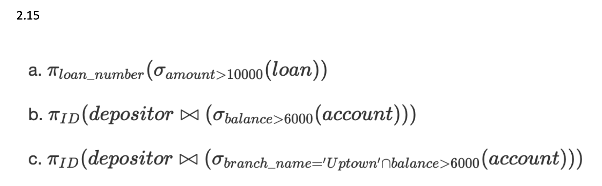
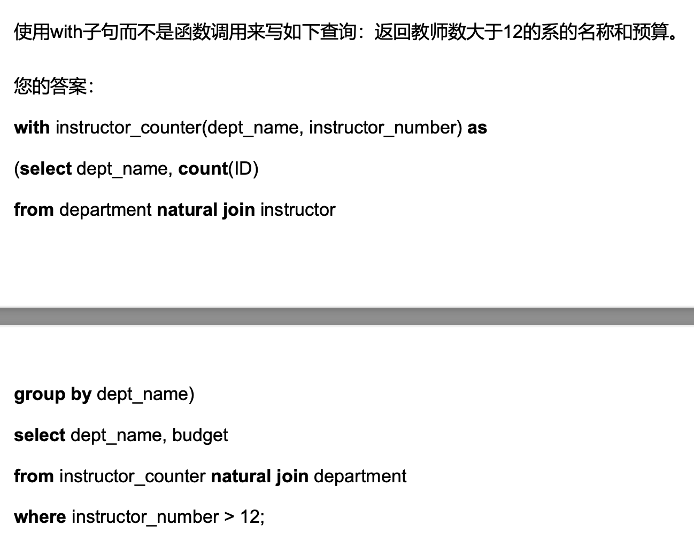
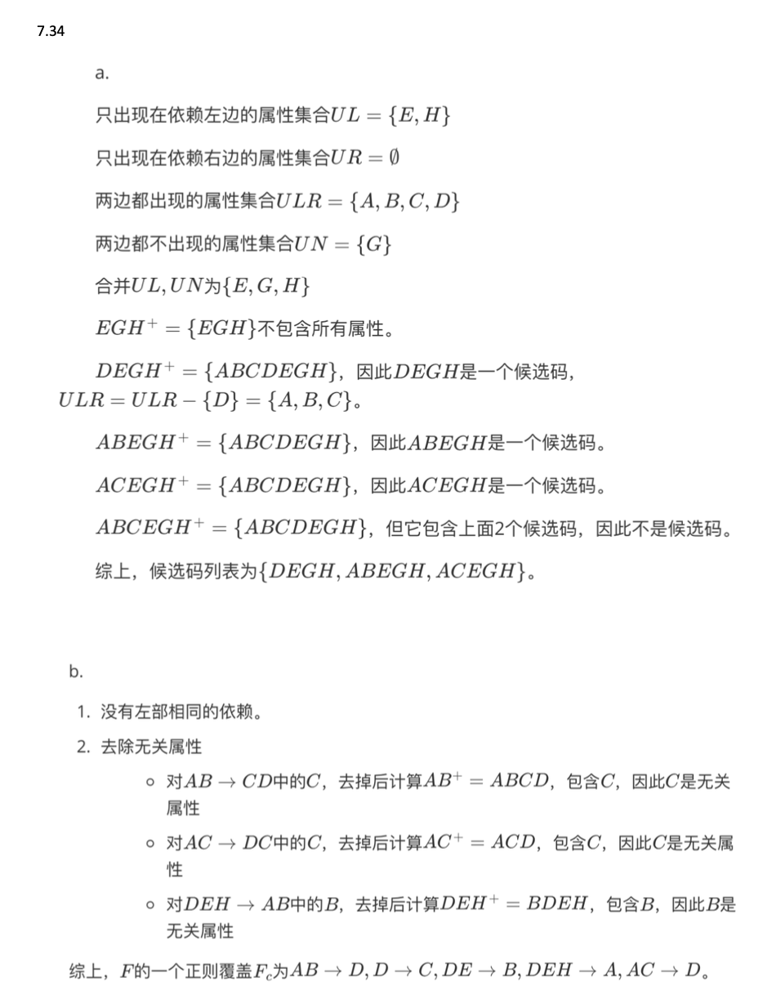
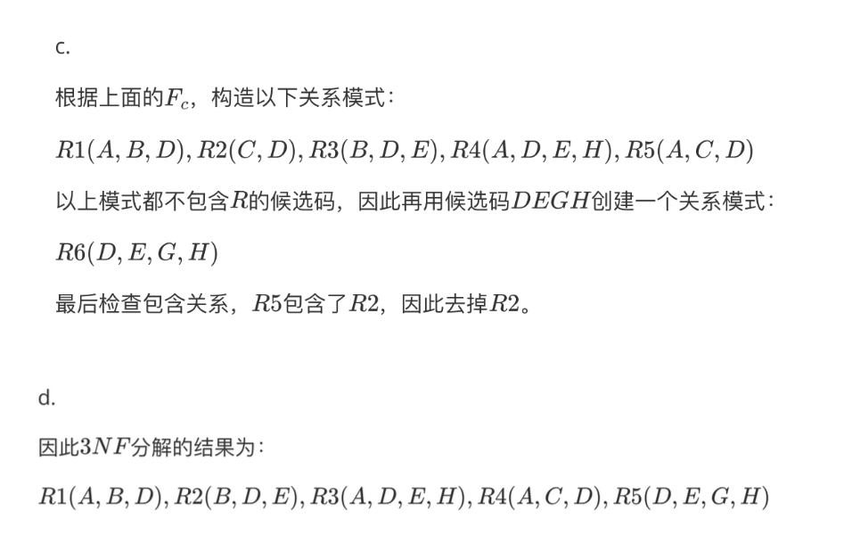
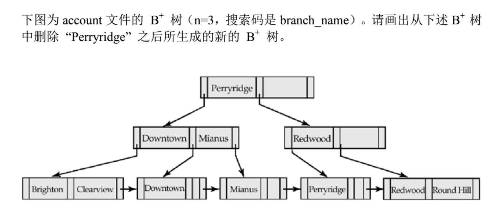
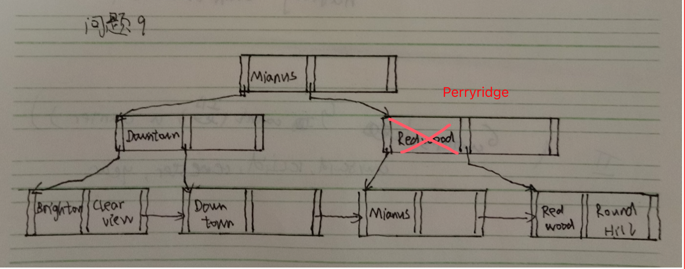

# 选择题

- 9个，一个3分
- 多为考概念，有些考SQL语言的细节，如create view的写法，null值判断
- 比较纠结的一些题：
  - **保持依赖**和**无损连接分解**之间有什么关系？是没关系，还是一方蕴含另一方，还是不能同时出现
  - 3NF分解的检查是不是NP难问题？3NF能否多项式时间内完成？3NF的保持依赖是否需要连接？（选错的，应该是3NF保持依赖不需要连接）
  - 哪个不是（。。。忘了怎么描述，好像意思是不完整、不图灵完备？）的语言？关系代数、元组关系演算、域关系演算、SQL，盲猜SQL（不确定），前3个都属于**形式化关系查询语言**

- 其他比较基础，会者秒选不难

# 大题

- 7个大题，很多是平时作业原题，也有发现往年真题


### 二

第七版（下面省略）书2.15原题，答案如下（c的$\cap$应该是$\and$）




### 三

- 7小题14分，都是大学模式的insert、delete
- 要熟记大学模式的各个属性是什么
- 注意下怎么一次insert多个元组，即把子查询查出来的结果作为insert的一部分
- 注意下外码约束，多次个表需要delete时要注意次序，先删外码引用了这个元组主键的表，否则报错违法约束条件


### 四

2020年考试原题（with的子查询应该是from instructor就够）




### 五

$employee(employee\_name,...)$

$manages(employee\_name,manager,...)$

分别用外连接和不用外连接，找出没有经理的雇员名字。（注意雇员没有经理分两种情况，一是他没有出现在manages里，二是出现了但他的manager为null）

答案：

```sql
# 使用外连接
select employee_name
from employee outer join manages
where manager is null

# 不使用外连接
select employee_name
from employee
where employee_name not in (
	select employee_name
  from manages
  where manager is not null
)

```


### 六

书上7.34原题






### 七

考了个位图，平时作业做了就没问题。


### 八

2020年考试原题



