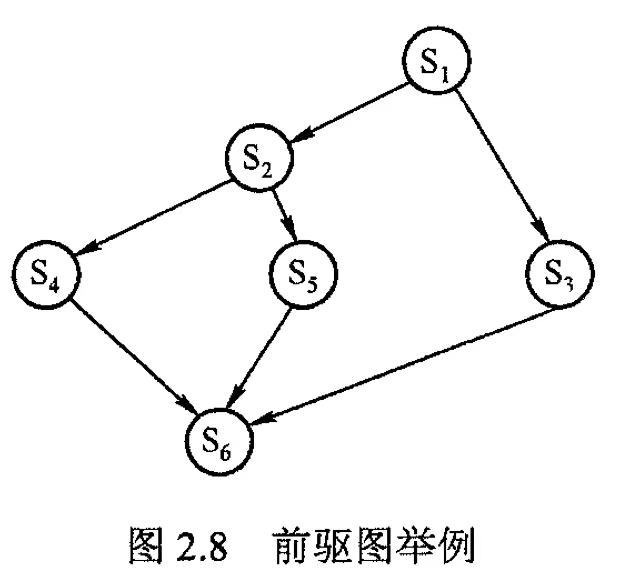
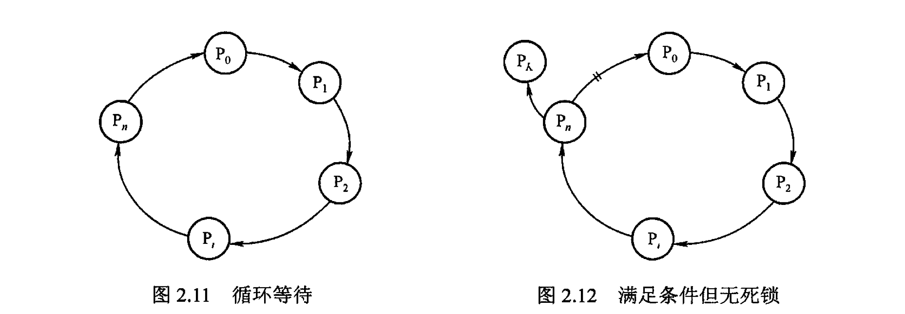
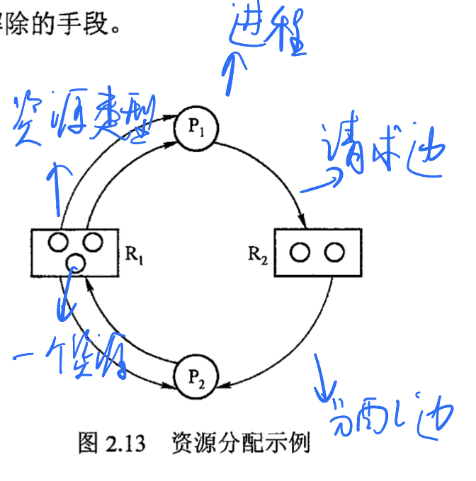
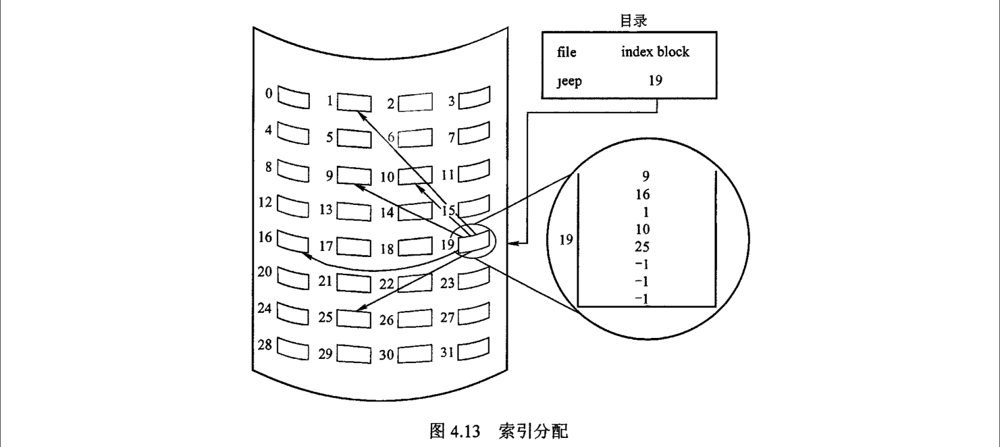
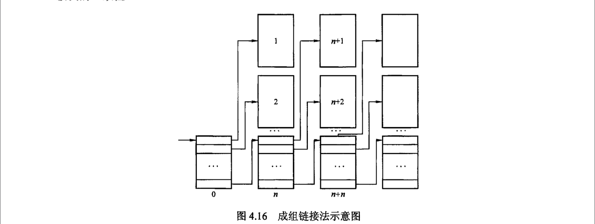

[toc]

# 概述

### 1.1 操作系统基本概念

##### 1.1.1 概念

- 系统软件

- 管理资源分配：提高**计算机利用率**

  - 进程管理
  - 存储器管理
  - 文件管理
  - 设备管理

- 为用户和其他软件提供硬件的方便接口

  

##### 1.1.2 特征

- 并发：多个事件在同一时间段内发生。
  - 和**并行**不同
  - 操作系统有处理和调度多个程序同时执行的能力
- 共享
  - 互斥共享方式：一段时间内只允许一个进程访问。**临界资源（独占资源）**如打印机
  - 同时访问方式：宏观上可以同时访问，微观上可能进程交替访问，如磁盘
- 虚拟
  - 把物理实体变成逻辑上的对应物
  - 虚拟处理器、虚拟内存、虚拟外部设备等
- 异步
  - 因为资源有限，进程的执行走走停停，所以操作系统运行于随机环境下


### 1.2 操作系统发展

- 手工操作阶段（无OS）
  - 用户独占全机
  - 资源利用率低
- 批处理阶段
  - 单道批处理：系统对作业处理是成批的，但内存中只有一道作业
    - 自动性
    - 顺序性
    - 单道性
  - 多道批处理：多个程序进入内存，在CPU中交替运行。宏观并行，微观串行
- 分时操作系统
  - 时间片轮转
  - 多个用户终端连接一台主机
  - 同时性、交互性、独立性、及时性
- 实时操作系统
  - 必须在时限内完成紧急任务，如自动控制系统、订票系统
- 网络操作系统和分布式计算机操作系统
  - 管理分布式计算机系统的操作系统称为**分布式计算机系统**
- 个人计算机操作系统
  - 应用最广泛，Windows Linux等


### 1.3 操作系统运行机制

**CPU运行两种程序**

- 操作系统内核程序：**特权指令**，运行于**核心态**
  - 时钟管理：计时；实现进程切换
  - 中断机制：提高CPU利用率。现代操作系统靠中断驱动。
  - 原语：原子操作
  - 系统控制的数据结构及处理
    - 进程管理
    - 存储器管理
    - 设备管理
- 用户自编程序（应用程序）：被管理程序，运行于**用户态**


**中断和异常**

中断（外中断）：CPU执行指令以外的事件发生

- 设备发出的IO结束中断
- 时钟中断

异常（内中断，陷入）：CPU执行指令内部的事件，不能被屏蔽，需要立即处理

- 非法操作码
- 地址越界
- 算术溢出
- 缺页


**系统调用**

用户调用操作系统提供的公共子功能，凡是与资源相关的操作都要通过系统调用向操作系统提出请求。

- 设备管理
- 文件管理
- 进程控制
- 进程通信
- 内存管理

用户态通过**访管指令**转到核心态，所以访管指令不是特权指令。

### 1.4 操作系统体系结构

- 大内核：操作系统主要功能模块都作为一个紧密联系的整体运行在核心态
- 微内核：将内核中最基本的功能（如进程管理）留在内核，不需要在核心态执行的功能移到用户态

# 进程管理


### 2.1 进程与线程

##### 2.1.1 进程的概念和特征

**进程概念**

>  **多道程序环境**下，允许多个程序并发执行，此时它们**失去封闭性、具有间断性和不可再现性**。因此引入**进程**概念，更好描述和控制程序的并发执行，实现操作系统的**并发性和共享性**（最基本两个特征）。

- PCB：进程控制块，使并发执行程序（和数据）能独立运行的**专门数据结构**，描述进程的**基本情况和运行状态**，进而控**制和管理进程**。
  - **PCB是进程存在的唯一标志**
- 进程映像（进程实体）：由**程序段、相关数据段和PCB**构成。
  - 创建进程实质是**创建进程映像中的PCB**，撤销进程实质是**撤销进程的PCB**
  - 进程映像是静态的，进程是动态的

- 利用进程映像定义进程：**进程的进程映像的运行过程，是系统进行资源分配和调度的独立单位。**


**进程特征**

> 进程的基本特征是对比单个程序顺序执行提出的，也是对进程管理提出的基本要求。

- 动态性：进程是程序的一次执行，具有生命周期，是动态地产生、变化和消亡的。**动态性是进程最基本的特征**。
- 并发性：多个进程同时存在于内存，能在一段时间内同时运行。**并发性是进程、同时也是操作系统的重要特性**。
- 独立性：进程映像是一个能**独立运行、独立获得资源和独立接受调度**的基本单位。
- 异步性：因为进程相互制约，进程具有**执行间断性、执行结果不可再现性**。因此操作系统必须配备**进程同步机制**。
- 结构性：每个进程配备一个PCB进行描述；进程映像（进程实体）由程序段、数据段和进程控制块三部分组成。


##### 2.1.2 进程的状态和转换

> 进程的**生命周期内**，由于**各个进程之间的相互制约关系**和**系统运行环境变化**，进程的状态也在不断变化。以下5种进程状态中，前3种为基本状态。

- 运行态：单道处理机环境下，每个时刻最多一个进程处于运行态。
- 就绪态：进程获取了处理机外一切所需资源，一旦获取处理机则进入运行态。多个处于就绪态的进程构成**就绪队列**。
- 阻塞态（等待态）：进程在**等待某事件**而暂停运行，如资源可用或IO完成。
- 创建态：进程正在被创建，尚未转到就绪态。创建进行步骤：1.申请一个空白PCB 2.向PCB写一些控制和管理进程信息 3.系统为进程分配运行时所需资源 4. 进程转入就绪态
- 结束态：进程正从系统中消失


> 3种基本状态的转换：

- 就绪态->运行态：处于就绪态的进程被**调度**后获得处理机资源，于是从就绪态转为运行态。（被动）
- 运行态->就绪态：处于运行态的进程时间片用完后，让出处理机，转为就绪态。**可剥夺式操作系统**中，更高优先级进程就绪时，调度程序把正在执行的进程转为就绪态。（被动）
- 运行态->阻塞态：进程请求某资源（如外设）的使用和分配或某事件发生（如IO完成）。用**系统调用的形式**（特殊的、用户态程序调用操作系统内核过程的形式）请求操作系统提供服务。（主动）
- 阻塞态->就绪态：进程等待的事件到来时，**中断处理程序**把进程状态转为就绪态。（被动）


##### 2.1.3 进程控制

> **原语**：进程控制中用的程序段，特点为执行期间不允许中断、是一个不可分割的基本单位。

**进程创建**

> 创建者进程为父进程，被创建进程为子进程。子进程继承父进程拥有的资源，子进程撤销时，把资源归还父进程。撤销父进程时，同时撤销其所有子进程。

- 创建原语
  - 为新进程分配一个唯一的进程标识号，并申请一个空白PCB。PCB申请失败，则创建失败。
  - 为进程分配资源，若资源不足，则进程处于阻塞态而非创建失败。
  - 初始化PCB
  - 新进程插入就绪队列，等待调度

**进程终止**

- 引起进程终止的事件
  - 正常结束：进程任务完成并准备退出执行
  - 异常结束：发生异常事件，如存储区越界、保护错、非法指令、算术运算错
  - 外界干预：进程应外界请求而终止，如操作系统干预、父进程请求和父进程终止
- 撤销原语
  - 根据终止进程的标识符检索PCB，读出其状态
  - 若处于执行态，则立即终止执行
  - 终止其所有子孙进程
  - 归还进程资源（给父进程或操作系统）
  - 将PCB从所在队列或链表删除

**进程阻塞和唤醒**

> Block和Wakeup原语是一对作用刚好相反的原语，需要成对使用。Block原语是被阻塞进程自我调用实现，Wakeup原语是其他进程调用实现。

- 阻塞原语
  - 找到被阻塞进程标识号对应的PCB
  - 若为运行态，保护现场，转为阻塞态
  - PCB插入相应事件等待队列，处理机调度给其他就绪进程
- 唤醒原语
  - 在该事件等待队列中找到进程PCB
  - 从等待队列中移除，置其状态为就绪态
  - PCB插入就绪队列

**进程切换**

> 处理机从一个进程的运行切换到另一个进程上运行，运行环境发生了实质变化。

- 进程切换过程
  - 保存处理机上下文
  - 更新PCB
  - PCB意如相应队列，如就绪、某事件的阻塞等队列
  - 选择另一个进程执行，更新PCB
  - 更新内存管理的数据结构
  - 恢复处理机上下文


##### 2.1.4 进程的组织

**进程控制块PCB**

- PCB是进程映像（实体）的一部分，是进程存在的唯一标志
- 进程执行时，系统通过PCB了解进程状态信息；进程结束时，系统回收其PCB，进程随之消亡。
- 进程整个生命周期中，系统总是通过PCB对进程进行控制。
- PCB信息主要部分
  - 进程描述信息
  - 进程控制和管理信息
  - 资源分配清单
  - 处理机相关信息
- PCB组织方式
  - 链接方式：同一**状态**PCB链接成一个队列，不同状态对应不同队列；也可以处于阻塞态的进程PCB根据**阻塞原因**排成多个阻塞队列。
  - 索引方式：同一状态进程组织在一个索引表里，不同状态对应不同索引表，如就绪索引表、阻塞索引表。


**程序段**

被进程调度程序调度到CPU执行的程序代码段。程序可以被多个进程共享。


**数据段**

可以是进程对应的程序加工处理的原始数据，也可以是程序执行时产生的中间或最终结果。


##### 2.1.5 进程的通信

> 进程之间的信息交换。PV操作是低级通信方式，高级通信方式有以下三种：

**共享存储**

- 通信的进程之间存在一块直接访问的共享空间，通过对其读写操作实现进程间信息交换。
- 对共享空间读写时，需要同步互斥工具，如PV操作


**消息传递**

进程间的数据交换以格式化的消息为单位。利用操作系统提供的消息传递方法实现进程通信，进程通过系统提供的**发送信息和接收信息两个原语**进行数据交换。

- 直接通信方式：发送进程直接把消息发送给接收进程，把它挂在接收进程的消息缓冲队列上，后者从中取得消息
- 间接通信方式：发送进程把消息发送到某个中间实体（信箱），接收进程从中取得消息（广泛用于计算机网络，称为电子邮件系统）


**管道通信**

- 管道：连接一个读进程和一个写进程以实现它们之间通信的一个共享文件。

- 发送进程以字符流形式把大量数据送入管道，接收进程从中接收数据。
- 管道机制必须提供的协调能力
  - 互斥
  - 同步
  - 确定对方存在
- 管道克服使用文件通信的两个问题
  - 限制管道大小：管道是一个固定大小的缓冲区，不会像文件那样不断增长。写管道变满，则后续对管道的write()调用被阻塞
  - 读进程可能比写进程快：管道变空，则后续对管道的read()调用被阻塞

> 从管道读是一次性操作，数据读出后就被管道抛弃、释放空间以便后续写。要实现双向通信，需要两个管道。
>
> 管道可以理解为共享存储的优化。共享存储中，必须没有其他进程在写才能访问，而管道将存储空间进化为缓冲区，只允许一边写入、另一边读出，因此只要有数据就能读出，不需要担心因为其他进程的2写操作而阻塞。


##### 2.1.6 线程概念和多线程模型

**线程基本概念**

> 引入线程的目的是减小程序在并发执行时所付出的时空开销，提高操作系统并发性能。

- 线程可以理解为「**轻量级进程**」，是一个**基本的CPU执行单元**，也是程序执行流的最小单元
- 线程是进程中的一个实体，是**被系统独立调度和分派的基本单位**
- 线程**不拥有系统资源**，只有一点必不可少的资源，可以与同属于一个进程的其他线程**共享进程的全部资源**
- 一个线程可以**创建、撤销**另一个线程，同一进程中多个线程可以**并发执行**
- 线程之间的相互制约使之呈现**间断性**
- 线程也有**就绪、阻塞、运行**三种基本状态

> 引入线程后，进程只作为CPU外系统资源的分配单位，线程则作为处理机资源的分配单位

**线程与进程比较**

- 调度：线程是**独立调度**的基本单位，进程是**拥有资源**的基本单位。进程中线程切换不引起进程切换，进程间线程切换则引起。
- 拥有资源：线程不拥有资源（所以切换线程的时空开销很小），可以访问其所在进程的系统资源
- 并发性：进程和线程间都可以并发执行，提供了系统并发性和吞吐量
- 系统开销：创建和撤销线程的系统开销比进程小的多，且同一进程内多个线程共享进程地址空间，其间的同步与通信容易实现，无需系统干涉
- 地址空间和其他资源：进程之间地址空间相互独立，同一进程线程间共享进程资源，某进程内线程对其他进程不可见
- 通信：进程间通信需要**进程同步和互斥手段**辅助，而线程间通信可以直接**读写进程数据段（如全局变量）**来通信


**线程属性**

> 多线程操作系统中的「进程处于执行态」实际上是该进程中某线程正在执行

- 线程不拥有系统资源，每个线程有一个唯一标识符和**线程控制块**
- 不同线程可以执行相同程序，如同一个应用程序被不同用户调用时被创建成不同线程
- 同一进程下的线程共享进程的资源
- 线程是处理机独立调度单位
- 线程创建后开始生命周期，历经阻塞、就绪、运行状态直到终止


**线程实现方式**

- 用户级线程（类似自己写程序时使用Thread）
  - 线程管理由应用程序完成，内核意识不到线程存在
- 内核级线程
  - 线程管理由内核完成，应用程序没有线程管理代码
- 组合方式
  - 线程创建、调度和同步在应用程序中进行，一个应用程序中的多个用户级线程被映射到更少数目的内核级线程上


**多线程模型**

> 不同的多线程模型，即用户级线程和内核级线程的连接方式

- 多对一模型
  - 多个用户级线程映射到一个内核级线程
  - 用户级线程对操作系统透明
  - 优点：线程管理在用户空间进行，效率高
  - 缺点：一个线程使用内核服务时阻塞，则整个进程阻塞；多个线程不能并行运行在多处理机上
- 一对一模型
  - 一个用户级线程映射到一个内核级线程
  - 优点：一个线程阻塞，另一个线程可以继续执行， 并发性高
  - 缺点：每创建一个用户级线程都需要一个内核级线程，创建开销比较大
- 多对多模型
  - 多个用户级线程映射到多个内核级线程（内核级线程更少）
  - 上面两种的折中


### 2.2 处理机调度

##### 2.2.1 调度的概念

> 处理机调度是**对处理机进行分配**，即从**就绪队列**中按照一定算法**选择一个进程**分配处理机。

**三级调度层次**

- 作业调度（高级调度）
  - 从外存上处于后备状态的作业中挑选一个，分配资源并建立进程，使之获得竞争处理机的资格
  - 是内存和外存之间的调度
  - 频率很低
- 中级调度（内存调度）
  - 将暂时不能运行的进程调到外存等待（挂起态）
  - 当进程具备运行条件，中级调度将其从外存调入内存，挂在就绪队列上（就绪态）
  - 提高了内存利用率
  - 频率介于两者之间
- 进程调度（低级调度）
  - 从就绪队列中选取一个进程，分配处理机
  - 频率最高，是最基本的调度，不可或缺


##### 2.2.2 调度的时机、切换和过程

- 不能进行进程调度和切换的情况
  - 处理中断过程中：中断处理过程复杂，很难实现进程切换，且中断属于系统工作，不属于某一进程，不应该被剥夺处理机资源
  - 进程在操作系统内核程序临界区中：进入临界区后，进程需要独占式访问共享资源，需要加锁防止其他进程进入，解锁前不应该切换到其他进程
  - 其他需要完全屏蔽中断的原子操作过程中：原子过程中断都需要屏蔽，进程调度和切换更应该屏蔽
- 应该进行进程调度与切换的情况
  - 发生引起调度条件且当前进程无法继续运行下去（**非剥夺式调度**）
  - 中断处理结束或自陷处理结束后（**剥夺式调度**）


##### 2.2.3 进程调度方式

> 进程调度方式是当某个进程运行时，若有优先级更高的进行进入就绪队列，应该如何分配处理机

- 非剥夺调度方式（非抢占方式）
  - 仍然让正在执行的进程继续执行，直到该进行完成或阻塞
  - 实现简单、系统开销小，适合大多数批处理系统，但不适合分时系统和大多数实时系统
- 剥夺调度方式（抢占方式）
  - 立即暂停正在执行的进程，将处理机分配给优先级更高的进程


##### 2.2.4 调度基本准则

> 为了比较调度算法性能，提出了以下几种评价准则。

- **CPU利用率**：尽可能让CPU利用率高
- **系统吞吐量**：单位时间CPU完成作业数量
- **周转时间**：从作业提交到作业完成经历的时间，即作业等待、在就绪队列中排队、在处理机上运行和进行IO操作花费时间总和
  - $周转时间=作业完成时间-作业提交时间$
  - $带权周转时间=\frac{作业周转时间}{作业实际运行时间}$
- **等待时间**：进程处于等待处理机状态时间之和
  - 处理机调度算法不影响作业执行和IO操作时间，只影响作业在就绪队列中的等待时间，所以**衡量调度算法优劣通常只看等待时间**

- **响应时间**：从用户提交请求到系统首次产生响应花费时间
  - 交互式系统中周转时间不是很好，一般用用响应时间


##### 2.2.5 典型调度算法

> 操作系统中有多种调度算法，有的适合作业调度、有的适合进程调度，有的都适合。

- 先来先服务调度算法FCFS

  - 选择队列中**最先进入的作业/进程**
  - 既可以作业调度，又可以进程调度
  - 属于不可剥夺算法
  - 对长作业有利，对短作业不利
  - 有利于CPU繁忙型作业，不利于IO繁忙型作业（CPU繁忙一次运行较久，IO繁忙需多次阻塞）
  - 不能用于分时系统和实时系统，通常和其他调度策略结合使用。

- 短作业优先调度算法SJF

  - 选择队列中**估计运行时间最短的作业/进程**
  - 既可以作业调度，又可以进程调度
  - 对长作业不利，可能导致**饥饿**
  - 不考虑作业紧迫程度，不能保证紧迫的作业及时处理
  - 只能根据估计的执行时间调度，所以不一定能做到真正的短作业优先
  - **SJF平均等待时间、平均周转时间最少**

- 优先级调度算法

  - 根据**某种优先级选择作业/进程**
  - 既可以作业调度，又可以进程调度
  - 根据是否可抢占，分为**非剥夺式优先级调度算法**、**剥夺式优先级调度算法**
  - 根据进程创建后优先级是否可变，将优先级分为**静态优先级**、**动态优先级**
  - 优先级设置参照原则
    - 系统进程>用户进程
    - 交互型进程>非交互进程（前台应用程序应该比后台的更快响应）
    - IO型进程>计算型进程（让IO设备尽早开始工作）

- 高响应比优先调度算法

  - 计算后备作业队列中每个作业的响应比，选出**响应比最高的作业**

  - 主要用于作业调度

  - 综合FCFS和SJF，同时考虑作业的等待时间和估计运行时间
    $$
    响应比R_P=\frac{等待时间+要求服务时间}{要求服务时间}
    $$

  - **等待时间越长、要求服务时间越短**，响应比越高

  - 对于长作业，克服了**饥饿问题**

- 时间片轮转调度算法

  - 主要适用于分时系统
  - 总是选择**就绪队列第一个进程**，即FCFS，但只允许运行一个时间片，时间片完则剥夺其处理机，被剥夺的进程返回就绪队列末尾
  - 时间片过大，则退化为FCFS；时间片过小，频繁进程切换降低系统性能

- 多级反馈队列调度算法

  - **综合时间片轮转和优先级调度算法，动态调整进程优先级和时间片大小**
  - 实现思想
    - 1～n级队列优先级逐次降低，时间片逐次增长
    - 新进程进入内存后，先在1级队列末尾，按FCFS等待调度；时间片内未执行完毕，则进入下一级队列末尾，再次FCFS；直到n级队列采用时间片轮转。
    - 仅当1～i-1级队列都空时，才调度i级队列中的进程。若调度下方队列时，有进程进入上方队列，则该进程抢占处理机，正在运行的进程进入i级队列末尾


### 2.3 进程同步

##### 2.3.1 进程同步基本概念

**临界资源**

**一次仅允许一个进程使用的资源**称为临界资源，如打印机等物理设备、变量和数据等可共享资源。

对临界资源的访问必须**互斥地**进行，**访问临界资源的代码称为临界区**。

对临界资源的访问过程可分为：

- 进入区entry section：检查是否可进入临界区，能进入则设置**正在访问临界区标志**，防止其他进程进入
- 临界区critical section：访问临界资源的代码
- 退出区exit section：将正在访问临界区标志清除
- 剩余区remainder section：其余部分


**同步**

又称直接制约关系，指多个进程为完成某任务需要在某些位置上协调其工作次序而等待、传递信息产生的制约关系。

进程间的**直接制约关系源于其相互合作**。

> 例如，进程A通过向缓冲区写数据与B通信，缓冲区空时，B不能获得数据而阻塞，A写入数据时唤醒B。
>
> 当缓冲区满，A阻塞，B取走数据时唤醒A。


**互斥**

又称间接制约关系，一个进程进入临界区使用临界资源时，另一个进程必须等待，占用临界资源的进程退出后才允许另一个进程访问临界资源。

> 例如，两个进程A、B要使用打印机，A在使用时，B阻塞，A释放打印机，唤醒B。


**同步机制应遵守准则**

- 空闲让进：临界区空闲，允许一个请求进入临界区的进程进入。
- 忙则等待：已有进程进入临界区时，其他请求进入的进程必须等待。
- 有限等待：请求访问的进程应该保证在有限时间内进入临界区。
- 让权等待：进程不能进入临界区时，应该立即释放处理器。


##### 2.3.2 实现临界区互斥基本方法

**软件实现方法**

> 进入区设置和检查一些标识来标明是否有进程在临界区，若有则通过循环检查进行等待，进程离开临界区在退出区修改标志。

- 算法一：单标志法

```c
// 设置一个公用变量turn，指示可以进入临界区的进程编号
// turn=0，允许P0进入；turn=1，允许P1进入
// 可以保证一次只有一个进程进入临界区，但两个进程必须交替进入，容易导致资源利用不充分

// P0进程
while(turn != 0);	// 进入区
critical section;	// 临界区
turn = 1;					// 退出区
remainder section;// 剩余区

// P1进程
while(turn != 1);	// 进入区
critical section;	// 临界区
turn = 0;					// 退出区
remainder section;// 剩余区

// 若多于2个进程，是否就设置turn可以取多个值？然后这些进程必须按次序访问？
```


- 算法二：双标志法先检查

```c
// 在每个进程访问临界资源前，先查看临界资源是否被访问，若正被访问则等待，否则进入临界区
// 设置数据flag[i]，第i个元素为false表示进程Pi未进入临界区，为true表示进程Pi进入了临界区

// Pi进程
while(flag[j]);		// 进入区
flag[i] = true;		// 进入区
critical section;	// 临界区
flag[i] = false;	// 退出区
remainder section;// 剩余区

// Pj进程
while(flag[i]);		// 进入区
flag[j] = true;		// 进入区
critical section;	// 临界区
flag[j] = false;	// 退出区
remainder section;// 剩余区

// 优点：不用交替进入
// 缺点：可能同时进入临界区，即Pi判断flag[j]为false后、Pi修改flag[i] = true之前Pj可能进入了临界区（违反忙则等待）
// 问题出在检查和修改操作不能一次完成
// 若多于2个进程，则是否维护一个bool列表，每次进入都要判断剩余所有进程对应的元素？
```


- 算法三：双标志法后检查

```c
// 修改算法二，先将自己标志设置为true，再检测对方标志

// Pi进程
flag[i] = true;		// 进入区
while(flag[j]);		// 进入区
critical section;	// 临界区
flag[i] = false;	// 退出区
remainder section;// 剩余区

// Pj进程
flag[j] = true;		// 进入区
while(flag[i]);		// 进入区
critical section;	// 临界区
flag[j] = false;	// 退出区
remainder section;// 剩余区

// 缺点：可能两个进程都执行完flag = true，结果都无法进入，导致饥饿（违反空闲让进）
```


- 算法四：Peterson's Algorithm

```c
// 为防止算法三的无限等待，又设置了turn，每个进程先设置自己标志后再设置turn，然后检查另一个进程的状态标志

// Pi进程
flag[i] = true;							// 进入区
turn = j;										// 进入区
while(flag[j] && turn == j);// 进入区
critical section;						// 临界区
flag[i] = false;						// 退出区
remainder section;					// 剩余区

// Pj进程
flag[j] = true;							// 进入区
turn = i;										// 进入区
while(flag[i] && turn == i);// 进入区
critical section;						// 临界区
flag[j] = false;						// 退出区
remainder section;					// 剩余区

// 结合算法一、三
// 既不会出现违反忙则等待，也不会出现违反空闲让进，也不会需要轮流进入
// 无论两边的while之前总共四行代码顺序如何，turn一定为i或j，两个flag都为true，也能进一个
```


**硬件实现方法**

- 中断屏蔽方法

  - 防止其他进程进入正在被访问的临界区的最简单方法是**禁止一切中断发生**

  - CPU只能在中断时引起进程切换，所以不中断就能保证临界区代码顺利完成

  - ```
    关中断;
    临界区;
    开中断
    ```

  - 限制了处理机交替执行程序能力，执行效率明显降低。

  - 对内核而言，执行更新变量等几条指令期间关中断很方便，但不要把关中断权利交给用户。

- 硬件指令方法

使用硬件实现以下两个不会被中断的指令

**TestAndSet指令**：原子操作，执行时不允许中断，功能为读出标志后置为真。

```c
// 为每个临界资源设置一个共享bool变量lock，为true表示正被占用，初值false

bool TestAndSet(bool *lock)
{
  bool old;
  old = *lock;
  *lock = true;
  return old;
}

// 使用该指令实现进程互斥
while TestAndSet(&lock);	// 进入区
critical section;					// 临界区
lock = false;							// 退出区
remainder section;				// 剩余区
```


**Swap指令**：交换两个字（字节）内容

```c
// 为每个临界资源设置一个共享bool变量lock，为true表示正被占用，初值false
// 为每个进程设置一个局部bool变量key，用于和lock交换信息

Swap(bool *a, bool *b)
{
  bool temp;
  temp = *a;
  *a = *b;
  *b = temp;
}

// 使用该指令实现进程互斥
key = true;					
while(key != false)	
  Swap(&lock, &key);	// 进入区
critical section;			// 临界区
lock = false;					// 退出区
remainder section;		// 剩余区

// 实质和TestAndSet一样
```


##### 2.3.3 信号量

> 信号量机制使用两个标准原语wait(S)（P操作）和signal(S)（V操作）来解决同步和互斥问题
>
> 原语：完成某种功能并且不能被分割、不能被中断执行的操作序列，通常硬件实现

**整型信号量**

```c
// 整型信号量为一个表示资源数目的整数S

void wait(int S) {
  while(S <= 0);	// 违背让权等待（进程申请不到资源还一直占用处理机，没有进行阻塞）
  S -= 1;
}

void signal(int S) {
  S += 1;
}
```


**记录型信号量**

```c
// 记录型信号量不存在“忙等”，即实现了让权等待
// 除了一个表示资源数目的整数value，还有一个进程链表L链接所有等待该资源的进程

typedef struct {
  int value;
  struct process *L;
} semaphore;

// 申请资源，若已分配完毕，则进程自我阻塞，放弃处理机，插入资源等待队列
void wait(semaphore) {
  S.value--;
  if(S.value < 0) {
    将此进程加入S.L;
    block(P);	//自我阻塞
  }
}

// 释放一个资源，S.value <= 0表示仍有进程在等待资源，因此要从中选一个进程唤醒
void signal(semaphore S) {
  S.value++;
  if(S.value <= 0) {
    从S.L中移出一个进程P
    wakeup(P);
  }
}
```


**利用信号量实现同步**

>  要先执行的语句执行后V，要后执行的执行前P。

```c
int semaphore S = 0;

P1() {
  ...
  x;
  V(S);
  ...
}

P2() {
  ...
  P(S);
  y;
  ...
}

// 语句y需要在x后面运行，因此让x运行完后释放一个资源（S操作），这样y才能获取该资源（P操作），从而执行
// 资源数目S应该初始化为0，防止y可以直接执行
```


**利用信号量实现进程互斥**

>  一对P、V夹紧临界区。

```c
// 把信号量机制看成互斥锁，实现进程互斥
int semaphore S = 1;

P1() {
  ...
  P(S);	// 加锁
  critical section;
  V(S);	// 解锁
  ...
}

P2() {
  ...
  P(S);	// 加锁
  critical section;
  V(S);	// 解锁
  ...
}
```


**利用信号量实现前驱关系**

> 同步的扩展



同步是两个节点之间的前后驱关系，把这种前后驱关系扩展到有向无环图：

```c
// 一共几条边就需要几个信号量，abc的命名是根据边的“层级”来的
int semaphore a1 = a2 = b1 = b2 = c = d = e = 0;

// 对每个程序段S，它的入边写成P操作，出边写成V操作
S1() {
  ...;
  V(a1);
  V(a2);
}

S2() {
  P(a1)
  ...;
  V(b1);
  V(b2);
}

S3() {
  P(a2)
  ...;
  V(e);
}

S4() {
  P(b1)
  ...;
  V(c);
}

S5() {
  P(b2)
  ...;
  V(d);
}

S6() {
  P(c);
  P(d);
  P(e);
  ...;
}
```


##### 2.3.4 管程

> 每个有临界区的进程都需要有PV操作，分散的PV操作给管理带来麻烦，容易死锁。
>
> 将系统资源共享数据结构、对该数据结构的一系列操作封装成一个类，称为**管程**，进程对管程的访问是互斥的。

**管程定义**

管程组成部分

- 管程名称
- 管程内的共享数据结构
- 对共享数据结构的初始化语句
- 对共享数据结构进行操作的一组过程

管程很像类，封装了共享资源和其上的操作；每次仅允许一个进程进入管程，各个进程只能串行执行管程内过程，实现进程互斥。

```c
monitor Demo {
  共享数据结构S;
  
  init() {
    S = 5;
  }
  
  take_away() {
    S--;
    ...
  }
  
  give_back() {
    S++;
    ...
  }
}
```


**条件变量**

> 条件变量是实现进程互斥进入管程的机制。
>
> 一个进程进入管程后被阻塞，直到阻塞原因解除其他进程都不能访问管程。
>
> 阻塞原因为条件变量condition，**阻塞原因可能多个，每个设置一个条件变量、维护一个等待队列**。
>
> 对条件变量只有wait和signal操作。

```c
monitor Demo {
  共享数据结构S;
  condition x;	// 条件变量x
  init() {...}
  take_away() {
    if(S <= 0) x.wait(); // 资源不足，进程在x上阻塞，加入等待队列
    资源足够，进程分配资源等处理
  }
  
  give_back() {
    归还资源，进行相应处理
    if(有进程在等待队列) x.signal();	//唤醒一个阻塞进程
  }
}
```

条件变量和信号量对比

- 相似点：条件变量的wait/signal类似信号量的P/V操作，实现进程的阻塞、唤醒
- 不同点：条件变量没有值，只实现了排队等待，剩余资源数用共享数据结构保存；信号量有值，信号量的值直接反映了资源数目。


##### 2.3.5 经典同步问题

**生产者-消费者问题**

> 最简单版本，生产者和消费者共享初始为空、大小为n的缓冲区，缓冲区未满生产者才能放入，缓冲区不空消费者才能取出。
>
> 缓冲区是临界资源，同一时刻只允许一个生产者或消费者访问。

```c
semaphore mutex = 1;
semaphore empty = n;
semaphore full = 0;

producer() {
  while(1) {
    P(empty);
    P(mutex);
    放入缓冲区;
    V(mutex);
    V(full);
  }
}

consumer() {
  while(1) {
    P(full);
    P(mutex);
    从缓冲区取走;
    V(mutex);
    V(full);
  }
}

// 注意P(empty/full)和P(mutex)不能颠倒，否则可能死锁。
// 两个V顺序任意。
```

> 稍微复杂版本，一个盘子容量为1个水果，爸爸放苹果、妈妈放橘子，儿子吃橘子、女儿吃苹果。
>
> 爸爸妈妈是互斥关系，父女、母子是同步关系，儿女没有互斥同步关系。

```c
// plate可视作空盘子资源，也可视作互斥锁，因为资源数=1所以可以结合在一起
semaphore plate = 1, apple = 0, orange = 0;

dad() {
  while(1) {
    P(plate);
    在盘子中放入苹果;
    V(apple);
  }
}

mom() {
  while(1) {
    P(plate);
    在盘子中放入橘子;
    V(orange);
  }
}

son() {
  while(1) {
    P(orange);
    从盘子中取走橘子;
    V(plate);
  }
}

daughter() {
  while(1) {
    P(apple);
    从盘子中取走苹果;
    V(plate);
  }
}
```


**读者-写者问题**

> 读者写者共享一个文件，多个读者可以同时读，写者和其他读者写者都互斥。
>
> 读写者、写者之间互斥，读者之间没有关系。
>
> 写者直接使用PV操作实现互斥，读者使用一个计数器记录读者数量，实现读写之间的互斥、而读者之间不互斥。

```c
int count = 0;
semaphore mutex = 1;	// count变量的互斥锁
semaphore rw = 1;			// 保证读写者互斥

writer() {
  while(1) {
    P(rw);
    writing;
    V(rw);
  }
}

reader() {
  while(1) {
    P(mutex);
    if(count == 0)	// 第一个读者读时，给rw上锁
      P(rw);
    count++;
    V(mutex);
    
    reading;
      
    P(mutex);
    count--;
    if(count == 0)	// 最后一个读者退出时，给rw解锁
      V(rw);
    V(mutex);
  }
}

// 这样实现的问题是写者优先级太低，可能被饿死。
// 为了提高写者优先级，设置信号量w，当一个写者希望访问缓冲区时，即使因为rw上锁需要等待，它也可以先给w上锁，防止后面再来读者让写者无限等待

int count = 0;
semaphore mutex = 1;	// count变量的互斥锁
semaphore rw = 1;			// 保证读写者互斥
semaphore w = 1;			// 写者可以给缓冲区单独上锁了

writer() {
  while(1) {
    P(w);		// 先上锁缓冲区，防止读写源源不断地进入
    P(rw);
    writing;
    V(rw);
    V(w);
  }
}

reader() {
  while(1) {
    P(w);						// 读者进入时需要先判断写者有没有上锁。reading后的退出区不需要判断。
    P(mutex);
    if(count == 0)	// 第一个读者读时，给rw上锁
      P(rw);
    count++;
    V(mutex);
    V(w);
    
    reading;
      
    P(mutex);
    count--;
    if(count == 0)	// 最后一个读者退出时，给rw解锁
      V(rw);
    V(mutex);
  }
}
```


**哲学家就餐问题**

> 5个哲学家坐一圈、每人面前一碗饭、两人之间一根筷子，共5根。
>
> 要吃饭则需要拿起左右两根筷子。
>
> 哲学家就餐问题和贪心算法截然相反，贪心容易造成死锁或饿死，这里使用互斥锁保护取筷子的动作，从而避免死锁发生

```c
semaphore chopsticks[5] = {1,1,1,1,1};
semaphore mutex = 1;

Pi() {		// i号哲学家，i范围0～4
  while(1) {
    P(mutex);					// 使用互斥锁保护取筷子为临界区代码，避免了5个人分别拿一根筷子造成死锁
    P(chopsticks[i]);
    P(chopsticks[(i + 1) % 5]);
    V(mutex);
    eat;
    V(chopsticks[i]);
    V(chopsticks[(i + 1) % 5]);
  }
}
```


**吸烟者问题**

> 吸烟需要烟草、胶水、纸三种材料，3个吸烟者每个人有其中一种，1个提供者每次在桌上放其中两种。
>
> 提供者每次随机放两种材料，并提醒其中一个可以抽烟的吸烟者将其消耗掉，吸烟者提供信号给提供者已完成。
>
> 提供者和吸烟者之间同步，吸烟者之间互斥（桌子只能放一次提供的两种材料）

```c
int num = 0;	// 0～2循环，模拟随机数
semaphore offer1 = 0;	// 对应烟草和胶水
semaphore offer2 = 0;	// 对应烟草和纸
semaphore offer3 = 0;	// 对应纸和胶水

provider() {
  while(1) {
    num = (num + 1) % 3;
    if(num == 0)
      V(offer1);
    else if(num == 1)
      V(offer2);
    else if(num == 2)
      V(offer3);
    
    P(finish);	//因为第一次提供不需要finish信号，因此放在循环末尾
  }
}

smoker1() {
  while(1) {
    P(offer1);
    做成烟，抽掉;
    V(finish);
  }
}

smoker2() {
  while(1) {
    P(offer2);
    做成烟，抽掉;
    V(finish);
  }
}

smoker3() {
  while(1) {
    P(offer3);
    做成烟，抽掉;
    V(finish);
  }
}
```


### 2.4 死锁

##### 2.4.1 死锁概念

> 死锁：多个进程竞争资源造成相互等待，若无外力作用，这些进程都将无法推进。

**死锁产生原因**

- 系统资源的竞争

  - 系统中拥有的不可剥夺资源数量不足以满足多个进程需要
  - **只有不可剥夺资源的竞争才产生死锁**，可剥夺资源不会引起死锁

- 进程推进顺序非法

  - **请求和释放资源顺序不当**导致死锁。如P1和P2保持了R1和R2，同时P1申请R2、P2申请R1，两者同时被阻塞
  - **信号量使用不当**造成死锁。进程间彼此等待对方发来消息

- 死锁产生必要条件

  > 总结：多个进程占有并相互竞争不可剥夺资源

  - 互斥条件：进程对分配的资源进行**排他性控制**，如打印机，同一时间内只能一个进程占有。
  - 不剥夺条件：进程使用完资源前**不能被强行夺走**，只能自己释放。
  - 请求并保持条件：进程持有资源，又提出新的资源请求、但资源被其他进程占有，则**请求进程被阻塞，同时对已持有的资源不释放**。
  - 循环等待条件：存在如下进程资源的循环等待链
    - 循环等待只是死锁的必要条件；如果同类资源数大于1，则可以实现破圈；如果等于1，则资源分配图含圈（存在循环等待）就是死锁的充要条件。



##### 2.4.2 死锁处理策略

- 死锁预防
  - 最严苛，实现简单
  - 破坏4个必要条件之一
- 避免死锁
  - 相对宽松，实现较为复杂
  - 用某种方法防止系统进入不安全状态，如银行家算法
- 死锁的检测和解除
  - 检测：死锁定理
  - 解除：资源剥夺；进程撤销；进程回退


##### 2.4.3 死锁预防

> 破坏死锁产生的四个必要条件之一

- 破坏互斥条件
  - 打印机等临界资源根本不支持共享使用，因此不可行
- 破坏不剥夺条件
  - 保持了不可剥夺资源的进程申请新资源但得不到满足时，需要释放已有资源
  - 反复申请和释放增加系统开销，降低吞吐量
  - 常用于状态易于保护和恢复的资源，如CPU寄存器和内存资源等，不能用于打印机等资源
- 破坏请求并等待条件
  - 进程运行前一次性申请完所需全部资源才开始运行，直到运行完毕才释放
  - 系统资源被严重浪费，有些资源可能只被短暂使用却被长期占有；可能导致饥饿
- 破坏循环等待条件
  - 顺序资源分配法，给系统中资源编号，每次申请资源必须按编号递增，同类资源一次申请完
  - 编号必须稳定，限制了新设备增加；经常进程使用资源顺序与编号不同，造成资源浪费；给用户编程带来麻烦

> 总结：死锁的预防太严苛，缺陷太严重

##### 2.4.4 死锁避免

> 不破坏死锁必要条件，而是资源动态分配过程中防止系统进入不安全状态，从而避免死锁

**系统安全状态**

即系统能找到某种进程推进序列（称为**安全序列**）$P_1,P_2,...,P_n$分配资源，使得可以为每个进程分配所需资源，直到满足每个进程的资源最大需求，都可以顺利完成。若找不到这样的序列，则系统处于**不安全状态**。

例：

| 进程 | 最大需求 | 已分配 | 可用 |
| ---- | -------- | ------ | ---- |
| P1   | 10       | 5      | 3    |
| P2   | 4        | 2      |      |
| P3   | 9        | 2      |      |

安全序列：$P_2,P_1,P_3$

其他顺序分配会进入不安全状态。


系统处于安全状态，便可以避免死锁；进入不安全状态，则可能进入死锁状态。


**银行家算法**


##### 2.4.5 死锁检测和解除

**资源分配图**

如下图，进程P1分得了2个R1资源，并请求一个R2资源；进程P2分得了1个R1资源和1个R2资源，并请求一个R1资源。




**死锁定理**

> 死锁定理：当且仅当S状态的资源分配图不可完全化简，则S为死锁。

化简方法

- 找出所有**既不阻塞（请求边连接的资源可以满足需求）又不孤立**的进程P，消去其所有请求边和分配边。
  - 如图b，P1和P2都不孤立。P1请求1个R2资源，可以满足，因此P1不阻塞，消去其所有边。
- 消去分配边后，资源得到释放，重新检测不阻塞的进程进行消去，直到**可以消去所有边，则图可以完全简化**。
  - 如图c，消去P1的分配边后资源R1可以满足P2需求，消去P2边，图完全简化了


**死锁解除**

- 资源剥夺：挂起某些死锁进程，抢占其资源，分配给其他死锁进程
  - 要防止挂起进程长时间得不到资源
- 进程撤销：强制撤销部分甚至全部死锁进程并剥夺其资源
  - 撤销原则可以按进程优先级、撤销进程代价高低等进行
- 进程回退：让一个或多个进程回退到足以回避死锁的地步
  - 进程回退时自愿释放资源而非被剥夺


# 内存管理


### 3.1 内存管理概念


##### 3.1.1 基础概念

**内存管理的功能**：

- 内存空间分配与回收
- 地址转换
- 内存空间扩充
- 存储保护

**程序链接与装入**


- 编译：源代码->**目标模块**
- 链接：一组目标模块+所需库函数->完整的**装入模块**
  - 静态链接：程序运行前，先将各目标模块及所需库函数链接成完整可执行程序，之后不再拆开
  - 装入时动态链接：一组目标模块，装入内存时，边装入边链接
  - 运行时动态链接：某些目标模块的链接，在程序执行到需要时才进行
- 装入：装入模块装入内存运行
  - 绝对装入：编译程序产生绝对地址的目标代码
    - 逻辑地址和实际内存地址完全相同，不需要转换
    - 只适用于单道程序
  - 可重定位装入：
    - 多个目标模块的起始地址都是0，其他地址相对于起始地址
    - 装入时进行**重定位**，对目标程序中的指令和数据进行修改
    - 地址变换在装入时一次完成，又称**静态重定位**
    - 静态重定位：一个作业装入内存，必须分配要求的全部内存空间，一旦装入内存就不能移动、不能申请内存空间
  - 动态运行时装入：**动态重定位**
    - 程序在内存中可以移动
    - 模块装入内存后并不立即把相对地址转为绝对地址，而是推迟到执行时进行
    - 装入部分代码即可运行，运行时需要动态申请分配内存


**逻辑地址和物理地址**

- **逻辑地址**：编译后，每个目标模块都从0开始编址，用户程序和程序员只知道逻辑地址
- **物理地址**：内存中物理单元集合，是逻辑地址转换（地址重定位）为的最终地址

##### 3.1.2 覆盖与交换

- 覆盖：一个进程内
  - 程序运行时不需要任何时候都访问程序和数据的各个部分
  - 把用户空间（另外一个是系统空间）分成**固定区**和若干**覆盖区**
    - 经常活跃的部分放在固定区
    - 其余部分按调用关系分段，即将要访问的放入覆盖区，其他放外存，需要时调入覆盖
  - 打破了一个进程必须全部装入内存后才运行的限制，但同时运行的代码量大于内存容量时仍不能运行
- 交换：不同进程间
  - **换出**：处于等待态的程序从内存移到外存
  - **换入**：准备好竞争CPU的程序从外存移到内存

##### 3.1.3 连续分配管理方式

>  为**一个用户程序**分配**一个连续的内存空间**。

- 单一连续分配

  - 内存分为**系统区**（操作系统用，在低地址）、用户区
  - 无序内存保护，内存中只有一道程序

- 固定分区分配

  - 把内存空间划分为若干固定大小区域，每个区域装入一道作业
  - 分区大小相等（如8MB、8MB。。。），分区大小不等（如2MB、4MB。。。）
  - 建立一张分区说明表，便于内存分配

  

  - 问题：可能程序太大放不进任何分区；内存利用率低，有**内部碎片**（无外部碎片）

- 动态分区分配

  - 不预先划分内存，而是进程装入内存时根据进程大小动态建立分区
  - 有外部碎片，可以通过**紧凑**（类似于windows的磁盘整理，但是是对内存）技术解决，但费时

  

- 动态分区分配策略

  - 首次适应算法First Fit：空闲分区**按地址递增**链接，分配内存时顺序查找，找到第一个满足要求的空闲分区
    - 最简单、最好、最快，现代操作系统通常采用
  - 最佳适应算法Best Fit：空闲分区**按容量递增**链接，分配内存时找第一个能满足要求的空闲分区，即刚好适合的最小分区
  - 最坏适应算法Worst Fit：空闲分区**按容量递减**链接，分配内存时找第一个能满足要求的空闲分区，即最大的分区
  - 邻近适应算法Next Fit（循环首次适应法）：在首次适应算法基础上，分配内存从上次查找结束位置开始继续找


##### 3.1.4 非连续分配管理方式

> **一个程序**分散地装入**不相邻的内存分区**。

**基本分页存储管理方式**

- 基本概念

  把内存空间和进程都划分为页。只产生页内碎片。

  - 页面和页面大小：内存中的块称为**页框**，进程中的块称为**页**，外存称为**块**。进程执行时申请内存空间，需要为每个页分配页框。页面过大则碎片增多；页面过小则页表过长，占用内存过多，且增加地址转换开销。

  - 地址结构：页号P+页内偏移W。12位页内地址，则每页大小4KB；20位页号，则共1M页；内存共4GB。

    

  - 页表：**每个进程建立一张页表**，记录页面在内存中对应的物理块号，页表一般放在内存中。

    

- 基本地址变换机构

  - 给定：页面大小L，进程的页表起始地址F，页表长度M，要把逻辑地址A转成物理地址E
  - 计算地址结构中的页号P和页内偏移W：$P=A/L$，$W=A\%L$
  - 判断越界：如果$P≥M$，则越界中断
  - 计算页号P在页表中对应页表项的地址：$F+P\times 页表项长度$
  - 取出该页表项的内容b，即为物理块号
  - 计算物理地址：$E=b\times L+W$

  

- 具有快表的地址变换机构

  - 增设一个高速缓冲存储器**快表**
  - 存放当前访问的若干页表项，利用了局部性原理，减少了访存次数。                                             

  

- 两级页表

  - 建立多级索引，就不需要把所有页表项装入内存，这和对进程的处理一样
  - 32位地址，12位页内偏移=>一个页4KB；顶级页表最多一个页面，所以一级10位；二级页号10位=>1K个二级页表项，一个页表项长度=地址=32位=4B，一个二级页表4KB，刚好可以在一个页内。

  


**基本分段存储管理方式**

分页从计算机角度考虑，提高内存利用率，对用户透明；分段从用户角度考虑，方便编程、信息保护和共享。

- 分段

  - 按照进程的自然段划分逻辑空间
  - 如进程包括主程序、2个子程序、栈和一段数据，则划分为5段，每段从0编址
  - 逻辑地址包括段号S和段内偏移W，如32位地址，S=W=16，则最多有64K个段，每段最长64KB。
  - 段内要连续，段间不需要，整个作业地址空间是二维的

- 段表

  - 类似页表，每个进程有一张逻辑空间和内存空间映射的段表
  - 段表项：段号+段长+本段在内存的起始地址

- 地址变换机构

  - 和页类似，根据地址的段号去找段表项，取出基址，计算物理地址


  

- 段的共享和保护


**段页式管理方式**

- 分页提高内存利用率，分段反映程序逻辑结构、有利于段的共享。结合起来称为段页式管理方式。

- 作业的地址空间先分成若干逻辑段，然后每段分成若干大小固定的页

- 作业逻辑地址分为：段号，页号，页内偏移

- 每个进程一张段表，每个段一张页表。
  - 段表项：段号，页表长度，页表起始地址
  - 页表项：页号，块号
- 访问3次内存：通过段表查页表起始地址；通过页表查内存页（页框，页帧，块）号；通过物理地址访存
- 整个段页式管理地址空间是二维的，段看作一维，每个段形成另一维


### 3.2 虚拟内存管理


##### 3.2.1 基本概念

- 传统存储管理方式特征
  - 一次性：作业必须一次性全部装入内存后，才能开始运行
    - 作业太大而不能全部装入内存，则无法运行
    - 大量作业要求运行，而内存不能容纳所有作业，则少数作业运行，多道程序度下降

  - 驻留性：作业装入内存后就一直驻留在内存中，任何部分都不会被换出直到运行结束

- **局部性原理**
  - 时间局部性：程序中某条指令/某数据一旦执行/访问，不久后很可能再次执行/访问
    - 通过将近来使用的指令和数据保存在高速缓冲存储器中实现

  - 空间局部性：程序访问了某个存储单元，不久后附近的存储单元也会被访问
    - 通过使用较大高速缓存


**虚拟内存技术建立了内存-外存两级存储器结构，利用局部性原理实现高速缓存。**

- 虚拟存储器

  - 定义

    - 程序一部分装入内存，其余留在外存，便可以执行程序
    - 所访问信息不在内存时，操作系统将所需部分调入内存， 然后继续执行
    - 系统提供了部分装入、请求调入和置换功能后，实现虚拟存储器

  - 特征

    - 多次性：作业运行时无需一次性全部装入内存，可以分成多次调入内存运行
    - 对换性：作业运行时无需一直留在内存，可以在运行时进行换入换出
    - 虚拟性：从逻辑上扩充内存容量

    

- 虚拟内存技术实现

  - 实现方式
    - 请求分页存储管理
    - 请求分段存储管理
    - 请求段页式存储管理
  - 硬件支持
    - 内存和外存
    - 数据结构：页表机制/段表机制
    - 中断机构：程序要访问部分未调入内存时，产生中断
    - 地址变换机构：逻辑地址转物理地址


##### 3.2.2 请求分页管理方式

- 概述
  - 基于基本分页系统；
  - 目前最常用的虚拟存储器实现方法；
  - 将一部分页面调入内存即可运行作业；
  - 作业执行时，所访问页面如果不在内存中，则通过调页功能调入；
  - 通过置换功能将暂时不用的页面换出到外存；
  - 需要**页表机制、缺页中断机构和地址变换机构**支持。

- 页表机制
  - 基本分页系统的页表项：页号；物理块号
  - 请求分页系统**新增4个字段**：
    - 状态位P：指示页是否调入内存
    - 访问字段A：记录本页在一段时间内被访问次数，或多久未被访问，在置换算法换出页面时参考
    - 修改位M：标识页在调入内存后是否修改过
    - 外存地址：该页在外存的地址，即物理块号，换入时参考

- 缺页中断机构
  - 要访问的页不在内存中，产生缺页中断，请求操作系统将缺的页调入
    - 缺页中断在指令执行期间而非完成后产生和处理，是**内部中断**
    - 一条指令执行期间，可能产生多次缺页中断

  - 缺页的进程**阻塞**（调页完成时唤醒）
  - 如果有空闲块，则分配一个块，将调入的页装入，修改页表对应页表项信息
  - 如果没有空闲块，则利用**页面置换算法**换出某页
    - 换出时如果该页被修改过，则要写会外存

- 地址变换机构


##### 3.2.3 页面置换算法

- 最佳置换算法OPT：无法实现
- 先进先出页面置换算法FIFO
  - 淘汰最早进入内存的页面
  - 把调入内存的页面按先后次序链接成队列，每次换出最早进入的页面即可
  - Belady异常：所分配的物理块数增大，但页故障数反而增加

- 最近最久未使用置换算法LRU
  - 选择最近最长时间未使用的页面淘汰
  - 每个页面设置一个访问字段A，记录上次访问以来的时间

- 时钟置换算法CLOCK


##### 3.2.4 页面分配策略

**驻留集大小**

> 驻留集：给一个进程分配的物理页框集合。

- 驻留集大小影响

  - 过小：驻留在主存的进程更多，提高了处理机时间利用率；但一个进程在主存中页数过少，页错误率较高

  - 过大：由于局部性原理，分配更多主存空间对进程的错误率可能没有明显影响

- 现代操作系统采用的页面分配策略

  - **固定分配局部置换**：为每个进程分配一定数目物理块，整个运行期间不改变。若缺页，则从该进程在主存中的页面中选一页换出。
    - 难以确定为每个进程分配的物理块数目
  - **可变分配全局置换**：最易实现，为每个进程分配一定数目物理块，OS自身保持一个空闲物理块队列，缺页时从该队列中取出一个物理块分配给进程
    - 盲目给进程增加物理块，可能导致系统多道程序并发能力下降
  - **可变分配局部置换**：为每个进程分配一定数目物理块，缺页时从该进程在主存中的页面中选一页换出。若频繁缺页，则为该进程分配若干物理块，直到缺页率趋于适当程度；反之减少分配的物理块。
    - 动态增加/减少进程的物理块，保证进程不会过多调页、保持了多道程序并发，实现复杂

**调入页面时机**

- **预调页策略**：根据局部性原理，一次掉入了若干相邻页可能比一次调入一页更高效。
  - 但调入的页若大多数未被访问，则低效
- **请求调页策略**：进程在运行中需要访问的页面不在内存中则提出请求，系统将所需页面掉入内存
  - 易于实现，大多数虚拟存储器采取。但调入/调出花费更多IO开销


**从何处调入页面**

- 请求分页系统的外存可分为：
  - 存放文件的文件区：离散分配方式
  - 用于存放对换页面的对换区：连续分配方式（因此对换区磁盘IO速度比文件区快）
- 从何处调入页面策略
  - 系统拥有足够对换区空间：全部从对换区调入，提高调页速度。因此进程运行前，需将进程有关的文件从文件区复制到对换区。
  - 系统缺少足够对换区空间：不会被修改的文件从文件区调入，换出时由于未被修改而不必换出；可能修改的部分，换出时需调到对换区，需要时再从对换区调入。
  - UNIX方式：与进程有关的文件都放在文件区，因此未运行过的页面都从文件区调入；运行过的页面换出倒对换区，之后也从对换区调入。


##### 3.2.5抖动

- 抖动：刚刚换出的页面马上要被换入主存；刚刚换入的页面马上要被换出主存
- 进程颠簸：一个进程在换页上花的时间多于执行时间
- 频繁抖动原因：某个进程频繁访问的页面数目高于可用物理页框数目


##### 3.2.6 工作集

- 工作集：某段时间间隔内，进程要访问的页面集合。
- 一般分配给进程的物理块数（即驻留集大小）大于工作集大小


##### 3.2.7 地址翻译


# 文件管理


### 4.1 文件系统基础


##### 4.1.1 文件的概念

- 系统运行时，以进程为基本单位进行资源调度和分配
- 用户IO时，以文件为基本单位
- 文件组成：存储空间；分类和索引信息；访问权限
- 文件结构
  - 数据项：最低级数据组织形式，基本数据项即原子数据是最小逻辑数据单元，组合数据项是多个基本数据项组成的
  - 记录：一组相关数据项的集合，描述一个对象某方面的属性，如数据库中的一个元组
  - 文件：创建者定义的一组相关信息集合。
    - 有结构文件：由一组相似的记录组成，如学生信息记录
    - 无结构文件：字符流，如二进制文件

- 文件基本属性：名称（唯一），标识符（内部数字，用户不可读），类型，位置，大小，保护，时间、日期和用户标识。所有文件信息保存在**目录结构**中，目录结构保存在外存上，文件信息需要时才调入内存。**目录条目**包括文件名称和唯一标识符，标识符定位其他属性信息。
- 文件基本操作：
  - 创建：在文件系统中找到空间，在目录中创建条目；
  - 写、读：系统调用指明文件名称和写入内容/读出位置，维护同一个读写指针，读写完后更新指针；
  - 重定位（文件寻址）：将当前文件设置为给定值
  - 删除：在目录中找到其目录项使之为空项，回收其存储空间
  - 截断：属性不变，删除内容并释放存储空间
- 文件打开与关闭：TODO

##### 4.1.2 文件的逻辑结构

文件的逻辑结构是用户看到的文件组织形式，即文件内部数据逻辑上如何组织起来。

- 无结构文件/流式文件
  - 最简单，将数据按顺序组织成记录并积累、保存，对记录的访问只能穷举，一般用作源代码文件、目标代码文件等
  
- 有结构文件/记录式文件
  - 顺序文件：文件中的记录一个一个顺序排列，记录定长，顺序存储或链表存储，访问需要顺序搜索文件。**批量操作时效率最高**，且只有顺序文件可以存储在磁带上（另外两种只能磁盘）。
    - 串结构：记录之间顺序与关键字无关，通常按存入时间顺序
    - 顺序结构：按关键字排列
    
  - 索引文件：建立一张**索引表**（本身是定长记录的顺序文件）。索引表项包括：索引号（顺序排列且唯一），记录长度，指针
    - 每个记录都对应一个索引表项
    - 顺序文件如果定长，可以很方便的找到第i条记录
    - 如果不定长，就要遍历，为此改进为索引文件，即增加一个索引表
    
    
    
  - 索引顺序文件：顺序和索引文件的结合。
    - 先把顺序文件进行分组，组内关键字可以无序，组间必须有序，然后建立索引表，为**每组第一个记录**建立索引项（包括关键字、指针）
    - 查找时，假设N个记录分为$\sqrt{N}$组，则顺序查找索引表平均$\sqrt{N}/2$次，组内顺序查找平均$\sqrt{N}/2$次，一共$\sqrt{N}$次，这样划分效率最高。
    - 可以采用多级索引，提高了存取速度，但增加了存储空间
    
    
    
  - 直接文件或散列文件Hash File：键值决定逻辑地址

##### 4.1.3 目录结构

目录结构是文件之间如何在逻辑上组织。

**文件控制块和索引结点**

- 文件控制块**FCB**：包括基本信息、存取控制信息、使用信息。
  - FCB的有序集合称为**文件目录**
  - 一个FCB就是一个文件目录项
  - 创建新文件，系统分配一个FCB并存在文件目录中

- UNIX将文件名和文件描述信息分开，文件目录结构项FCB只包括文件名、索引结点编号；文件描述信息单独形成称为索引结点的数据结构（i结点）。这样一个盘块就可以放下更多FCB了。

---

**目录结构**

目录层次上需要执行的操作：搜索，创建文件，删除文件，显示目录，修改目录

- 单级目录结构
  - 在整个文件系统中只建立一张目录表，一个文件占一个目录项（FCB）
  - 搜索：按文件名在目录中找到FCB
  - 创建文件：先检索有无重名，然后新增一项
  - 删除文件：找到FCB，回收存储空间，删除FCB
  - 查找速度慢，不允许文件重名，不便于文件共享
  
  
  
- 两级目录结构
  - 分成主文件目录MFD（每个对应一个用户）、用户文件目录UFD
  - 某用户要访问时，找到对应的UF D，解决了文件重名和一定程度保证文件安全
  
  
  
- 多级目录结构（树形目录结构）
  - 最熟悉，树状目录
  - 引入文件路径（绝对、相对）、当前目录的概念
  - 文件分类方便，层次清晰，便于文件管理保护，但查找文件需要访问中间结点，增加了访问磁盘次数
  
  
  
- 无环图目录结构
  - 实现文件共享


##### 4.1.4 文件共享

多个进程、用户共享一个文件，节省空间。

- 基于索引结点的共享方式：硬链接
  - 树形结构目录中，要共享文件（子目录），需要将文件（子目录）链接到多个用户的目录中
  - 使用索引结点，文件信息放在其中，而非目录项中；而且记录count数，表示有几个链接
  - 创建时count=1，删除时count-1；count=0，系统删除文件
- 利用符号链实现文件共享：软链接
  - TODO


##### 4.1.5 文件保护

TODO


### 4.2 文件系统实现


##### 4.2.1 文件系统层次结构

- 用户调用接口：新建、打开、读写、关闭、删除等API【用户对OS发出命令】
- 文件目录系统：管理文件目录【OS查找目录中文件的索引信息，FCB或索引结点】
- 存取控制验证模块：实现文件保护，比较访问控制权限【检查用户有没有访问权限】
- 逻辑文件系统与文件信息缓冲区：根据文件逻辑结构将用户读写的逻辑记录转换成文件逻辑结构内相应块号【得到逻辑地址】
- 物理文件系统：把逻辑记录所在的相对块号转成物理地址【逻辑地址转成物理地址】
- 辅助分配模块：管理外存空间，分配空闲空间和回收空间【若要释放空间】
- 设备管理程序模块：管理磁盘等设备【若要输入输出】


##### 4.2.2 目录实现

打开文件OS要根据路径名找到目录项，目录实现有线性列表和哈希表两种，分别对应线性查找、散列查找。

- 线性列表：存储文件名和数据块指针的线性表。创建、删除都和链表一样。
- 哈希表：文件名--->哈希值，返回指向线性列表中元素的值


##### 4.2.3 文件实现——文件分配方式

对磁盘非空闲块的管理。

- 连续分配

  每个文件占有一组连续的块，文件的目录条目包括文件名、开始地址、长度。

  优点：支持顺序访问、随机访问、存取速度最快

  缺点：文件不能太长，移动麻烦，产生外部碎片，只适用于定长文件


- 链接分配

  把每个文件的块做成链表，文件的目录条目包括文件名、开始地址、结束地址

  优点：提高了磁盘利用率，便于文件动态增删改

  缺点：不能直接访问盘块，只能顺序访问，指针消耗存储空间，盘块损坏容易导致数据丢失

  隐式链接分配：


​	显式链接分配FAT表：把链接指针从盘块中抽取出来成为单独一张表。

FAT表在系统启动时读入内存，因此效率高。-2表示空闲盘块，因此很方便找空闲区。

解决了链接分配不支持直接访问的问题（？）


- 索引分配

  把每个文件所有盘块号放在一个盘块（索引块/表）里，文件目录项只包括文件名、索引块号。

  优点：支持直接访问，没有外部碎片

  缺点：增加空间开销，需要访问两次内存（可以先把索引块读取内存解决）

  索引块不够装处理方案：

  - 链接：大文件的多个索引块链接起来
  - 多层索引：链接太多索引块也慢，不如将索引块们看作一个大文件，增加一个上层索引
  - **混合索引**：块内既有直接地址，又有一级索引，又有二级索引。。。对小文件访问快，大文件也有足够空间存





- 分配方式对比
  - 连续分配：访问第n条记录需要访问磁盘1次，优点：存取速度最快，文件定长时可随机访问，缺点：要求连续存储空间，产生外部碎片，不利于动态变化
  - 链接分配：访问第n条记录需要访问磁盘n次（FAT表1次），优点：解决外部碎片，动态变化方便，缺点：指针消耗空间，只能顺序访问，效率低（FAT表在内存中顺序查找，效率不低）
  - 索引分配：访问第n条记录需要访问磁盘m+1次（m为索引级数），优点：可以随机访问，方便动态变化，缺点：增加空间开销

**注意：写文件需要读访问x次磁盘+写访问1次磁盘，读完后地址就获得了，写只需要额外一次。**

##### 4.2.3 文件实现——文件存储空间管理

对磁盘空闲块的管理。

- 空闲表法

  属于连续分配方式，与文件的动态分配方式类似。空闲表每个条目包括序号、第一个空闲盘块号、空闲盘块数（长度）

  与内存动态分配类似，有首次适应算法、循环首次适应算法等。

- 空闲链表法

  - 空闲盘块链表：把空闲空间以盘块为单位形成链表。分配和回收简单，只需要在链表末尾取下、插入，但一个文件等分配需要多次操作。
  - 空间盘区链表：把空闲空间以盘区为单位形成链表。每个节点除了有链表指针除了指明下一盘区地址，还记录本盘区长度。分配采用首次适应法，回收时要考虑合并。

- 位视图法

  - 一个矩阵，其元素个数位盘块个数，每个值是二进制的一位，表示一个盘块是否空闲
  - 分配：顺序扫描，找到一个值为0的盘块，通过$b=n(i-1)+j$ 计算其盘块号，然后修改该位为1
  - 回收：用DIV和MOD计算矩阵中该盘块的位置，修改为0

- 成组链接法

  - 大文件系统中空闲表和空闲链表占有空间太大
  - 成组链接法结合两者：把顺序的n个空闲扇区地址保存在第一个空闲扇区内，后一个空闲扇区则保存另一顺序空闲扇区的地址。系统只需要保存第一个空闲扇区的指针。
  - 如下图，盘块0保存了1~n-1空闲盘块的地址和盘块n的地址，而盘块n是下一组空闲扇区的第一个。




### 4.3 磁盘组织与管理


##### 4.3.1 磁盘的结构


- 磁盘组成：**盘面**，**磁道**，**扇区（即一个盘块）**
  - 磁道是盘面上一组同心圆，有上千个
  - 磁道划分为几百个扇区
  - 盘块是基本单位
  - 密度从外到里增加，磁盘存储能力取决于最内道最大密度
- 磁盘地址：**柱面号-盘面号-扇区号**，即先确定同心圆半径、再确定哪个盘片、再确定扇区
- 磁盘分类
  - 磁头径向固定：**固定头磁盘**；磁头可移动：**活动头磁盘**
  - 磁盘固定在驱动器里：**固定盘磁盘**；可移动和替换：**可换盘磁盘**


##### 4.3.2 磁盘调度算法


**磁盘读写时间**

- **寻找（寻道）时间**：磁头移动到指定磁道的时间（通常最长）

  $T_s=m\times n+s$

  m为磁盘驱动器速度常数，n为跨越磁道数，s为磁臂启动时间

- **旋转延迟时间**：磁头定位到指定扇区到时间

  $T_r=\frac{1}{2r}$

  r为磁盘每秒转数

- **传输时间**：从磁盘读出或向磁盘写入数据的时间

  $T_t=\frac{b}{rN}$

  b为读写字节数，r为磁盘每秒转数，N为一个磁道上字节数

**磁盘调度算法仅与寻道时间（最长）有关**，后面两种时间跟磁盘转速关系很大。

如果一个文件一个磁道存不下，优先存到不同盘面的同一个磁道上，因为寻道时间最长。


---

**磁盘调度算法**


模型：一根横轴，上面标注的数字表示磁道，一般0最内；有个点是磁头起始位置，向下，磁头在各个点之间移动。一般要算磁头移动距离之和。

- 先来先服务算法 FCFS
  - 根据**进程访问磁盘先后顺序**进行调度，最简单
  - 具有公平性，若访问进程数少、大部分请求簇聚，性能较好
  - 若大量进程访问，则接近于随机调度，所以通常使用更复杂的调度算法
- 最短寻找时间优先算法SSTF
  - 选择**与当前磁头距离最近的磁道**进行调度
  - 贪心算法，每次寻找的时间最短，但不一定平均寻找时间最短（有一个在102，起始100-99-98-...-0，最后要返回102，不如先去102平均时间短）
  - 可能产生**饥饿**，如果后面的进程总在磁头附近访问，则距离远的会饿死
- 扫描算法（电梯调度算法）SCAN
  - 选择**磁头当前移动方向上距离最近的磁道**进行调度，即在SSTF上限定了磁头运动方向，与电梯类似，磁头双向循环扫描，先增大、后减小、又增大
  - 对最近访问过的区域不公平，访问局部性不如前两个算法
- 循环扫描算法C-SCAN
  - **在SCAN基础上限定磁头单向移动**，回返时直接移动到起始端，不在返回路上进行服务
  - SCAN偏向于访问靠近最里或最外的磁道，C- SCAN解决了这个问题
  - 继续改进为LOOK/C- LOOK调度：**磁头移动只需要到达最远处的请求即可返回**，而不需要到磁盘端点
- 调度算法对比
  - FCFS太简单，性能差，仅适合磁盘IO很少的情况
  - SSTF比较通用和自然，但可能饿死
  - SCAN和C-SCAN在磁盘负载大时比较好
- **对盘面扇区交替编号来减少延迟时间**
- 寻道、延迟可以通过方法削减，传输时间由磁盘本身性质决定，不能减少


##### 4.3.3 磁盘的管理

- 磁盘初始化
  - 低级格式化：在磁盘存储数据之前，分成扇区来让磁盘控制器可以读和写
  - OS将自己的数据结构记录在磁盘上：1.分成一个或多个柱面组成的分区 2.对物理分区逻辑格式化（创建文件系统） 
- 引导块
  - 计算机启动时运行一个初始化程序，初始化CPU、寄存器、内存等，启动OS。该程序找到磁盘上的OS内核，装入内存，转到起始地址，从而运行OS
- 坏块
  - 扇区可能损坏
  - 处理坏块就是用某种机制让系统不去使用坏块，坏块是硬件故障，OS无法修复